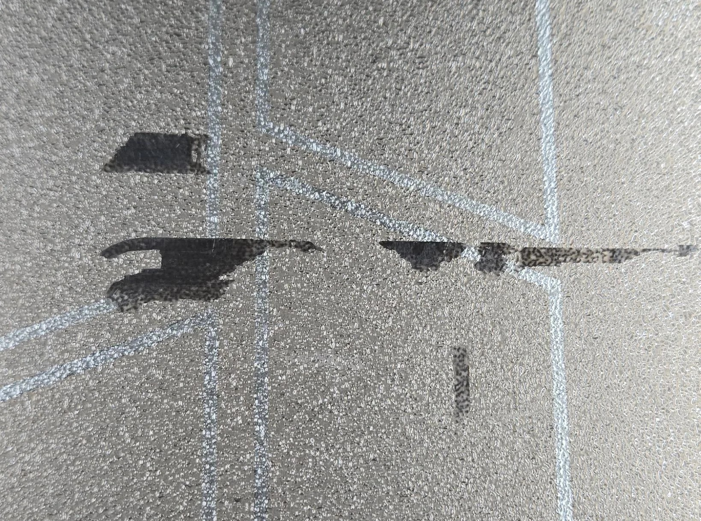
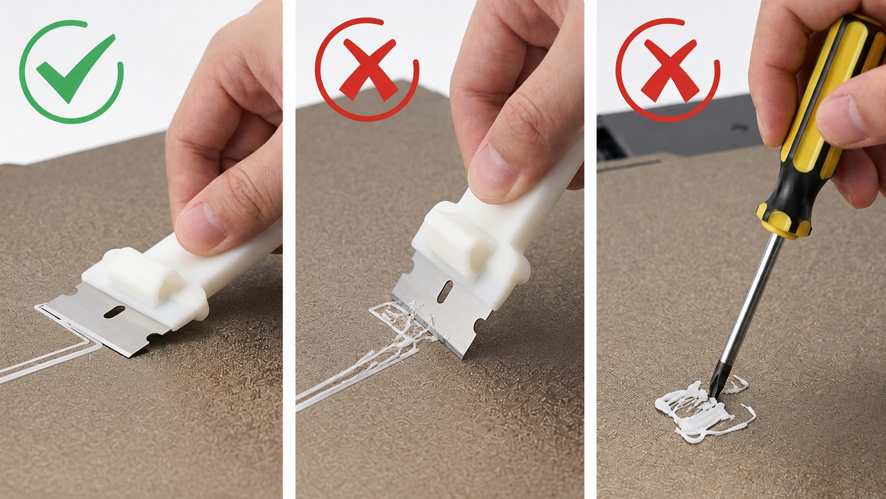
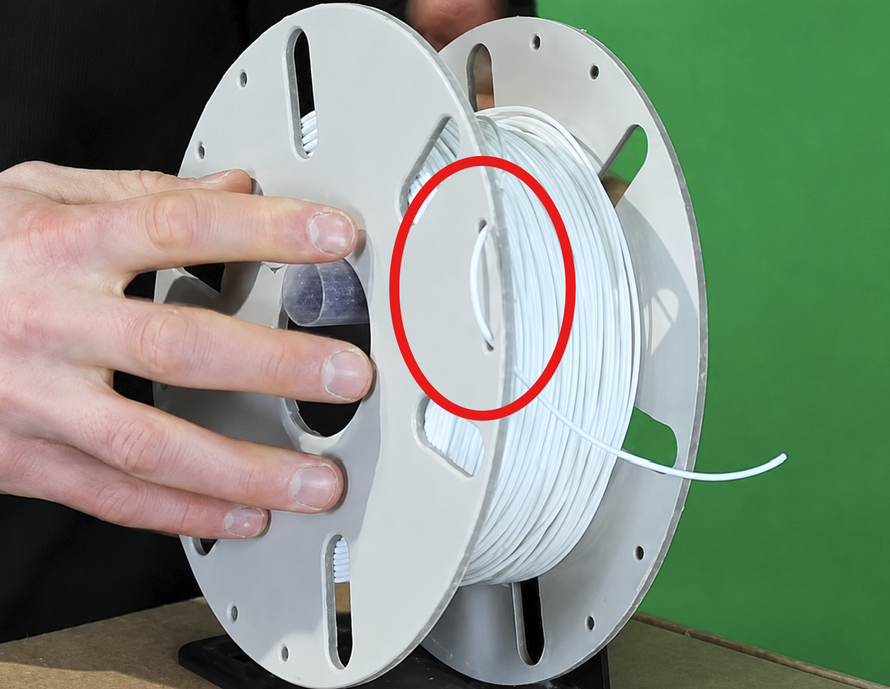

# Proper Use

Good print quality starts with good habits. Most printer issues in the lab are caused by things that are easily avoidable.

## Use filament the printer is rated for

Only use filament that you are sure the printer can handle.

Our printers can handle PLA, PETG, and TPU (nothing carbon fiber). If you are not sure whether a filament type is okay to use, ask for help before loading it.

## Let the plate cool before removing prints

Wait until the build plate has cooled down before pulling a print off. Hot plates can warp parts, damage the plate surface, or make prints harder to remove cleanly.

## Remove leftover brim and supports from the plate

After removing your print, check the build plate for leftovers like brim pieces or support scraps. Clear those off right away so the next print gets a clean first layer.

>Here is an example of a brim piece that got left on the plate. It's just good etiquette to clean up after yourself and make sure the next person has a clean plate to work with.

Try to use your fingers to remove anything that's stuck but if you have to, you can use a scraper--don't reach for random tools like screwdrivers, snips, or anything that can gouge/scratch the plate.

If you need a scraper, be gentle and angle it to slide under the stuck material rather than digging into the plate.

## Clean off glue and grime

If you used glue, wash it off once you're done. If the plate is just looking dirty, do the same.

Use dish soap and water, then dry the plate fully before putting it back into use.

## Handle filament carefully when swapping rolls

When changing filament, secure the loose end through the spool loops so the roll cannot unwind and tangle.

Then zip the filament box closed to keep moisture out.
