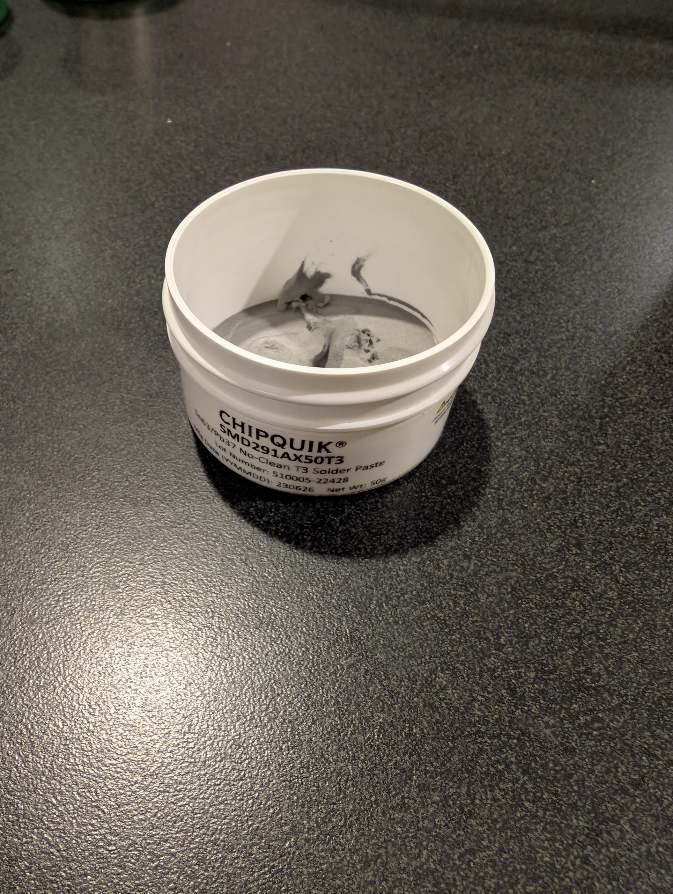
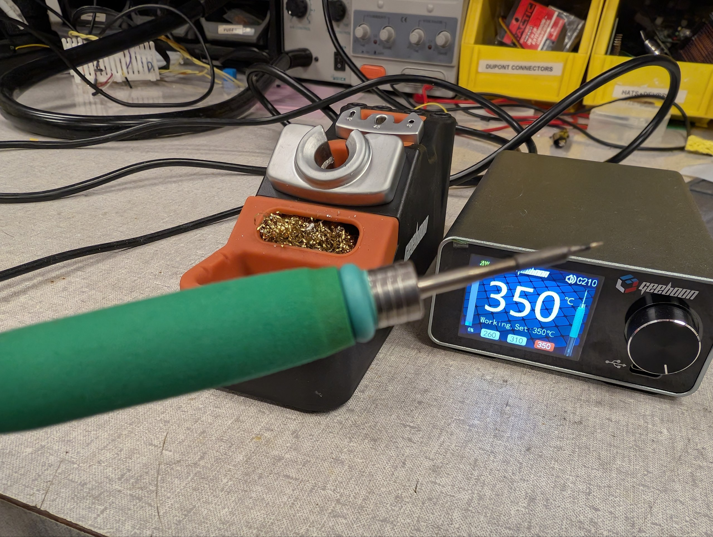
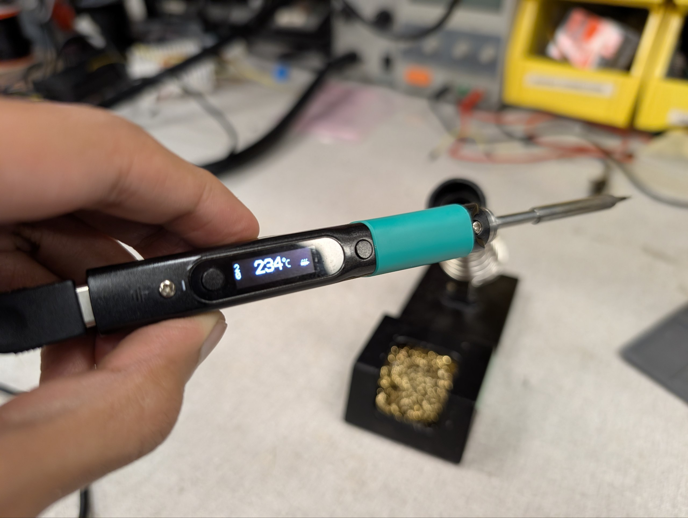
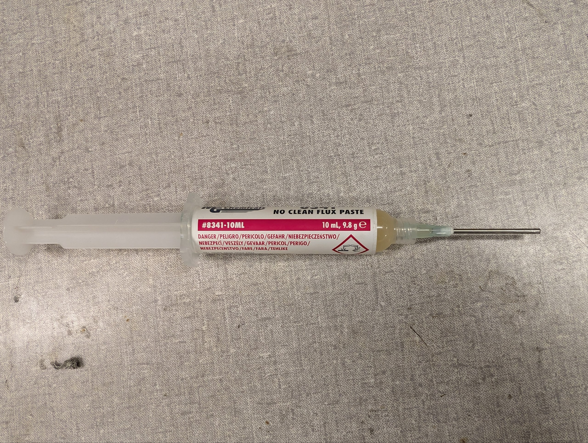
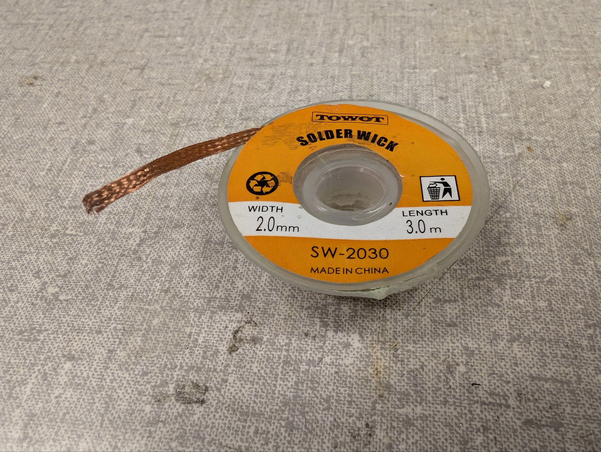
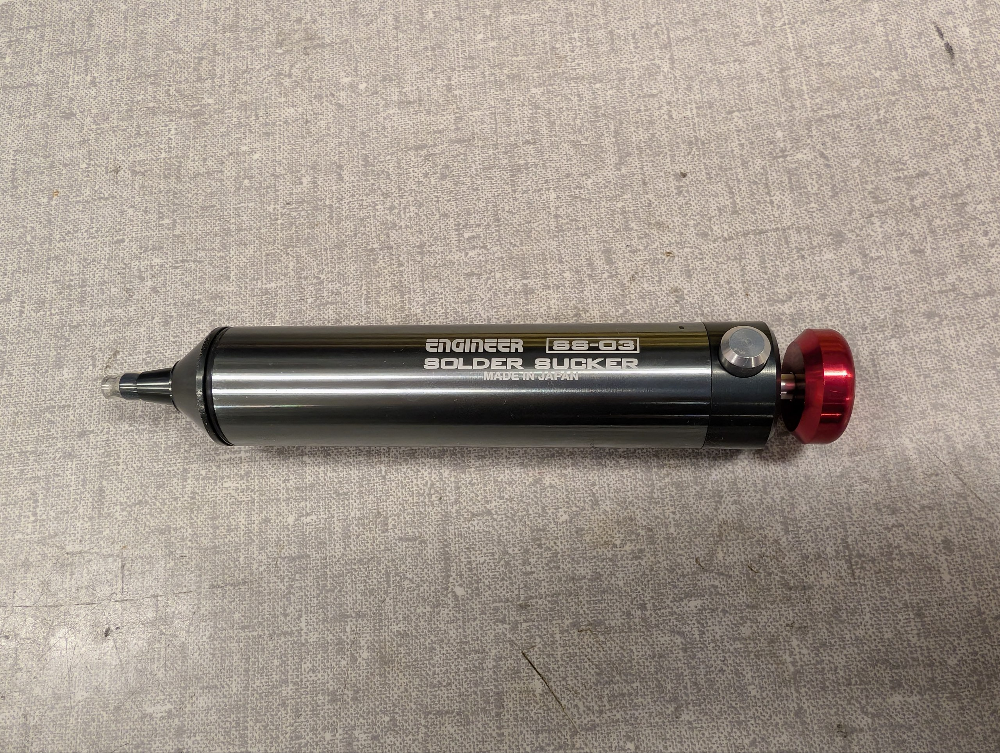
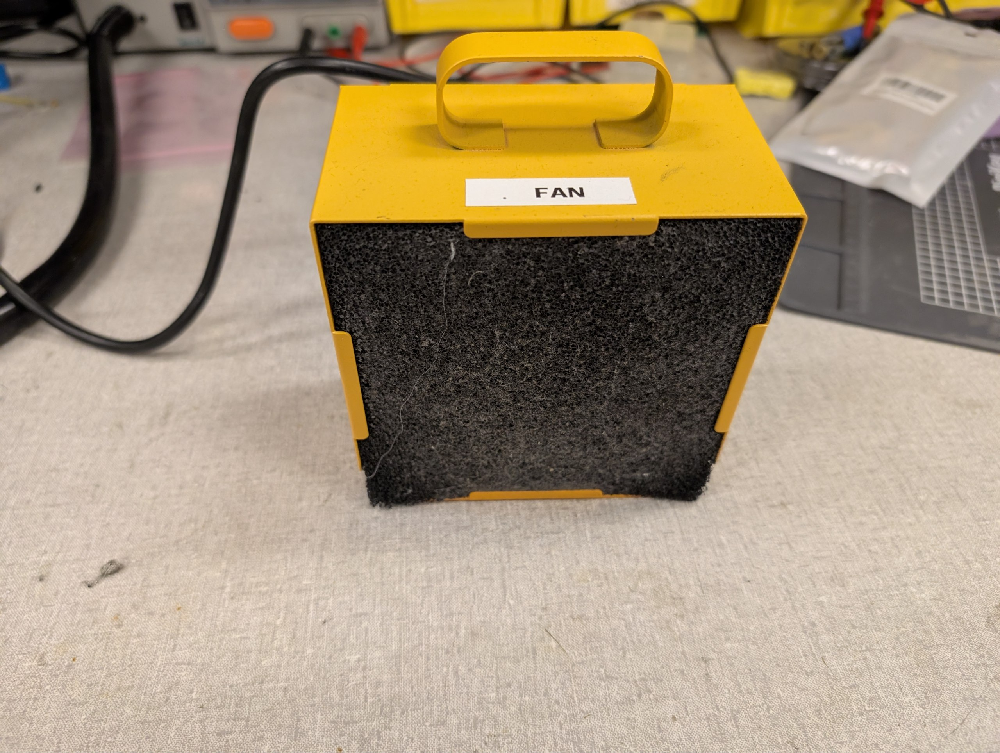
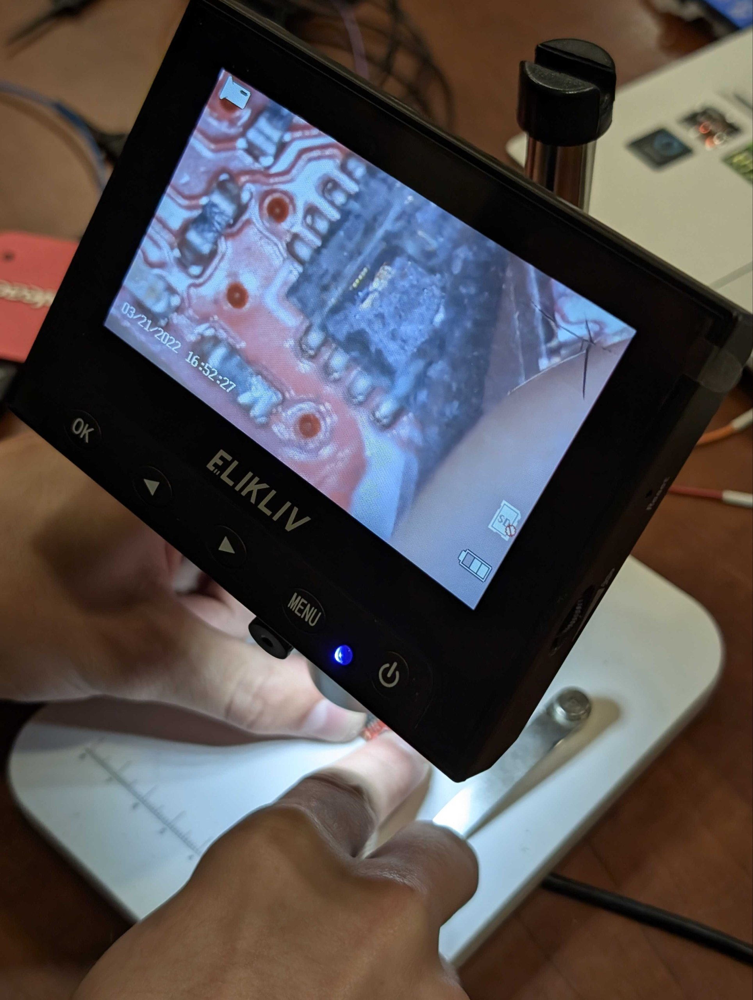

# Soldering

Soldering is the process of joining two or more electronic components together by melting a [filler metal](#solder) to create a strong electrical and mechanical bond.

This guide will cover the basics of soldering, including the tools and materials needed, the steps to soldering, some tips for achieving good results, and of course safety precautions.

## Tools and Materials

There are several tools and materials that you will need for soldering. Here are some of the most common ones:

### Solder

Solder is a metal alloy, often made of tin and optionally, lead. It comes in the form of a thin wire or a paste and is used to create a strong bond between electronic components.

Here are 3 types of solder we have in the lab:

**Unleaded 0.3 mm**

{ width="60%" loading="lazy" }

Fine pitch work, high melting point

**Leaded 0.8 mm**  

{ width="60%" loading="lazy" }

Lower melting point, much more easier to work with

**Solder paste**  

{ width="60%" loading="lazy" }

A thick paste used for soldering surface mount devices (SMDs). Usually at a much lower melting point (< 200°C). Requires a [reflow oven](#reflow-oven) or [hot air rework station](#hot-air-rework-station).

When should you use what solder? It depends on the application. 

For general-purpose soldering, a thicker solder (like 0.8 mm) can be easier to work with and provides stronger joints. 

Solder paste is typically used for surface mount devices (SMDs) and requires specialized equipment for reflow soldering, such as a [reflow oven]() or a [hot air rework station](#hot-air-rework-station).

The choice between leaded and unleaded solder depends on personal preference. It is much easier to work with leaded solder since it has a lower melting point and better flow characteristics. 

!!! warning "Lead Safety"
    Leaded solder contains lead, which is toxic. Always **wash** your hands after handling leaded solder, since there are fine particulates that can settle on your fingers. Always use a [fume extractor](#fume-extractor) when soldering to avoid inhaling flux fumes.

### Soldering Iron

A soldering iron is a handheld tool that heats up to melt [solder](#solder). It typically has a pointed tip that allows for precise application of heat to the components being soldered.

We have 2 good soldering irons in the lab:

-  { width="70%" loading="lazy" }

    **TC 22 Soldering Station**  
    Digital display, extremely fast heat up time, should be the go-to soldering iron.

- { width="70%" loading="lazy" }

    **Pinecil Soldering Station**  
    Compact, portable, and USB-C powered (needs a good 35W+ PD cable).

### Flux

Flux is a chemical agent that helps to clean, remove oxides, promotes wetting, and improves the flow of [solder](#solder) and the quality of the joint. It can come in various forms, such as liquid, paste, or as a core in solder wire.

We have 2 types of flux in the lab:

-  { width="70%" loading="lazy" }

    **Flux Pen**  
    Depress the tip to release flux, needs cleaning after soldering
  
- { width="70%" loading="lazy" }

    **No-Clean Flux**  
    Suitable for general use, does not require cleaning after soldering.

### Solder Wick

Solder wick, also known as desoldering braid, is a braided copper wire that is used to remove excess [solder](#solder) from a joint. It works by absorbing the molten solder when heated with a [soldering iron](#soldering-iron).

-  { width="60%" loading="lazy" }

    **Solder Wick**  
    The copper braid absorbs molten solder

### Solder Sucker

A solder sucker, also known as a desoldering pump, is a handheld tool that creates suction to remove molten [solder](#solder) from a joint. It typically consists of a plunger and a nozzle that can be placed over the molten solder to be removed.

-  { width="70%" loading="lazy" }

    **Solder Sucker**  
    Press down the red push head of the plunger to create suction, place the nozzle over molten solder, and hit the release button to suck up the solder.

-  { width="70%" loading="lazy" }

    **Old Solder Sucker**  
    A more traditional design - can be less effective since the suction isn't as strong.

### Fume Extractor

This is a simple centrifugal fan which when turned on, creates negative pressure to pull in the fumes generated during soldering. There is an activated carbon filter inside the fume extractor which adsorbs the fumes before releasing the air back into the environment.

-  { width="50%" loading="lazy" }

    **Fume Extractor**  
    Simply turn it on and place it near your soldering work to capture the fumes.

### Tip Tinner

Tip tinner is a maintenance product for soldering iron tips. It typically contains flux and a sacrificial [solder](#solder)/metal compound that helps remove oxides and restores the plated surface of a tip.

This is only used as a last resort if your soldering iron tip is oxidized and not wetting properly. Should be used sparingly.

-  { width="40%" loading="lazy" }

    **Tip Tinner**  
    Simply heat the soldering iron tip and dip it into the tip tinner compound.

### Kapton Tape

Kapton tape is a polyimide film tape with excellent heat resistance and electrical insulation properties.

You apply the tape in areas of a PCB you don't want heated from a [soldering iron](#soldering-iron) or [hot air rework station](#hot-air-rework-station). Our tape is rated for 250°C.

-  { width="50%" loading="lazy" }

    **Kapton Tape**  
    High-temperature insulating tape commonly used in SMD work.

-  { width="40%" loading="lazy" }

    **Kapton Tape on FIRM**  
    Real world use of kapton tape while reworking on a [FIRM]().

### Hot Air Rework Station

A hot air rework station uses a heated stream of air to melt [solder](#solder), allowing removal and replacement of surface-mount devices (SMDs), reflowing solder paste, and performing heat-based repairs (e.g., heat-shrink tubing).

TODO: Include pictures of different nozzles

-  { width="40%" loading="lazy" }

    **Hot Air Rework Station**  
    The hot air rework station we have. You can control the temperature and airflow, and use different nozzles as well.

### Reflow Oven

A reflow oven is a specialized piece of equipment used for soldering surface-mount devices (SMDs) to printed circuit boards (PCBs). It provides precise control over the temperature profile, allowing for consistent and reliable soldering of all components simultaneously.

-  { width="40%" loading="lazy" }

    **Reflow Oven**  

    The reflow oven present in the [ECE Makerspace](https://my.ece.ncsu.edu/makerspace/training/). You can set the temperature profile according to the solder paste you're using, and it will heat the PCB accordingly.

### Miscellaneous

Miscellaneous tools that can be helpful for soldering include:

#### Helping Hands

{ width="50%" loading="lazy" }

Plate with 4 adjustable arms with alligator clips, used to hold components, wires, or PCBs in place while soldering. Feels like having an extra hand.

#### Vise

{ width="40%" loading="lazy" }

A more heavy-duty option for holding PCBs or components in place while soldering.

#### Tweezers

{ width="60%" loading="lazy" }

Tweezers are essential for handling small components, especially SMDs. They allow for precise placement and adjustment of components during soldering.

#### Isopropyl Alcohol

{ width="40%" loading="lazy" }

Isopropyl alcohol is used for cleaning PCBs and removing flux residue after soldering. Always use 99% isopropyl alcohol for cleaning PCBs.

#### Wire Strippers

{ width="20%" loading="lazy" }

Wire strippers are used to remove the insulation from wires before soldering them together or to a PCB. To strip a wire, just place the it on the top and squeeze the handles.

#### Brass Wool

{ width="40%" loading="lazy" }

Brass wool is used for cleaning soldering iron tips. It removes the oxidation layer on the tip. Always rub the iron tip on the brass wool before and after soldering to maintain the tip.

#### Microscope

{ width="25%" loading="lazy" }

This microscope goes up to 1000x magnification. Focus is controlled by the knob on the bottom, and the arm height can be adjusted by the knob on the side.

#### Soldering Mat

{ width="40%" loading="lazy" }

A soldering mat is a heat-resistant surface that provides a safe and organized workspace for soldering. We have 2 mats. The Digikey mat is preferred since it is made of silicone.

--- 

## How to Solder

There are mainly three types of soldering tasks you'll encounter: soldering SMT (Surface Mount) components, through-hole components, and joining two wires together. Each of these tasks requires a slightly different technique and approach, but the basic principles of soldering apply to all of them.

-  { width="60%" loading="lazy" }

    **PCB with SMD pads and through holes**  
    
    This PCB has both SMT pads (the small rectangular pads) and through holes (the big circular holes on the right).

-  { width="40%" loading="lazy" }

    **Person SMD Soldering**  
    
    This is the general setup for soldering SMD components. You hold the [soldering iron](#soldering-iron) in your dominant hand and use tweezers in the other hand to position the component. Or if it's already placed, you hold the [solder](#solder) instead.
    
    The [fume extractor](#fume-extractor) is placed nearby to capture any fumes generated during soldering.
      

### SMT Soldering

SMD (Surface Mount Device) components are soldered directly onto pads on the surface of a PCB.

Soldering SMD components can be more challenging than through-hole components due to their small size and lack of leads, but with the right tools and techniques, it can be done effectively.

There are a few ways to solder SMD components. We cover some of the processes here:

#### Single SMD component

This is the most basic method of soldering SMD components. You would use this method when you only have a few components to solder, and they are simple components, such as resistors, capacitors, or ICs whose legs are easily accessible.

!!! Warning 
    If your component has pads on the bottom (like a BGA), then you cannot use this method since you won't be able to heat the joint properly. See [this section](#single-smd-component-with-pads-on-the-bottom) for that.

**Required:**

- [Soldering Iron](#soldering-iron)

    !!! Tip
        A fine tip such as a knife tip is recommended for SMD soldering. The sharp edge holds solder better and allows for more precise application of heat.

- [Solder](#solder)

    !!! Tip
        Depending on how small your component or the pad is, you may want to use a thinner solder (like 0.3 mm) for better control and precision. Leaded solder can also be easier to work with for SMD soldering due to its lower melting point and better flow characteristics.

**Optional:**

- [Flux](#flux)
- [Isopropyl Alcohol](#isopropyl-alcohol)
- [Tweezers](#tweezers)

**Steps:**

TODO: Insert video here.

1. Place the PCB: Secure the PCB on a stable surface, such as a [soldering mat](#soldering-mat) or in a [vise](#vise).
2. Prepare the PCB: Clean the PCB with isopropyl alcohol specially if there's dirt.
3. Apply flux: Using [flux](#flux) is highly recommended. The no-clean flux is preferred over the flux pen, but either will work. Apply it directly to the pads where the component will be soldered.
4. Apply solder: Touch the [soldering iron](#soldering-iron) tip to the pad and feed a small amount of [solder](#solder) onto the pad. The solder should melt and form a very thin layer on the pad.
5. Place the component: Use tweezers to position the SMD component accurately on the pads.
6. Solder the component: Heat the joint by gently touching the [soldering iron](#soldering-iron) tip to the pad and the component lead simultaneously. Since there is solder already on the pad, it should melt and form a good joint between the pad and the component lead.

#### Single SMD component with pads on the bottom

For components like [QFNs](https://en.wikipedia.org/wiki/Flat_no-leads_package) or [BGAs](https://en.wikipedia.org/wiki/Ball_grid_array), the pads are on the bottom of the component, so you won't be able to heat the joint properly with a soldering iron. In this case, you can use solder paste and a [hot air rework station](#hot-air-rework-station) to solder the component.

**Required:**

- [Solder Paste](#solder-paste) or [Solder](#solder)
- [Hot Air Rework Station](#hot-air-rework-station)
- [Flux](#flux)

**Optional:**

- [Kapton Tape](#kapton-tape) to protect nearby components from heat
- [Tweezers](#tweezers)

**Steps:**

=== "Using Solder Paste"
  
    1. Place the PCB: Secure the PCB on a stable surface, such as a [soldering mat](#soldering-mat) or in a [vise](#vise).
    2. Prepare the PCB: Clean the PCB with 99% isopropyl alcohol specially if there's dirt
    3. Apply solder paste: Use a stencil, toothpick, or a syringe to apply solder paste onto the pads where the component will be soldered.
    
        !!! Note
            Solder paste contains flux, so you don't need to apply additional flux when using solder paste. It is also okay if there are some "bridges" of solder paste between the pads, because during reflow, the surface tension of the molten solder will help to pull the solder into the correct shape and position on the pads.
      
    4. Place the component: Use tweezers to position the SMD component accurately on the pads. The solder paste will help to hold the component in place.
    5. Reflow the solder: Use a [hot air rework station](#hot-air-rework-station) to heat the area around the component. Hold the nozzle about 1-2 inches away and move it in small circles to ensure even heating. You may see the component "pop" into place as the solder melts and forms a good joint between the pads and the component leads. This is when you can stop heating and let it cool down.
    
        !!! Tip
            - If there are nearby components that you don't want to heat, you can use [kapton tape](#kapton-tape) to protect them from the heat.
            - You should keep the temperature of the hot air rework station about 20-30°C above the melting point of the solder paste you're using. The airflow setting is typically at the lowest in order to avoid blowing the component away, but for larger components, you may need to increase the airflow to ensure even heating.
    
    6. Verify the joint: After the solder has cooled, inspect the joint under a microscope to ensure that it is properly formed and there are no solder bridges or unflowed joints (this is almost impossible for pads under the component). If there are any issues, you can reheat the joint with the hot air rework station to fix them.
  
=== "Using Solder"

    You follow the steps outlined in the [previous section](#single-smd-component) to apply solder to the pads, but instead of using a soldering iron to heat the joint after placing the component, you use the [hot air rework station](#hot-air-rework-station) to heat the area around the component until the solder melts and forms a good joint between the pads and the component leads. You should see the component "pop" into place when the solder melts. That's when you can stop the heat application.
    
    !!! Note
        - You should use a slightly higher temperature, around 300C for leaded solder, and about 330C for unleaded solder.
        - If your solder coat on the pad was too much, you will find that the component does not sit flat on the surface. See this [tip]() to resolve that.
    
#### Soldering a whole PCB at once

Soldering a whole PCB at once is typically done using a reflow oven, which allows for precise control of the temperature profile to ensure proper soldering of all components simultaneously.

You can reflow both sides of the PCB at once if both the sides have small enough components so that they would not fall off when the solder melts due to surface tension. Any larger or heavier components should be soldered separately *after* the reflow process.

**Required:**

- [Solder Paste](#solder-paste)
- [Reflow Oven](#reflow-oven)

**Steps:**

1. Apply solder paste: Use a stencil to apply solder paste onto all the pads where components will be soldered. It's okay if there are some "bridges" of solder paste between the pads, because during reflow, the surface tension of the molten solder will help to pull the solder into the correct shape and position on the pads.
2. Place components: Use tweezers or a [pick-and-place machine](https://reporter.ncsu.edu/link/courseview?courseID=COE-ECE-MAKE212&deptName=COE) to position all the components accurately on the pads. The solder paste will help to hold the components in place.
3. Reflow the solder: Place the PCB in the reflow oven and run the appropriate temperature profile for the solder paste you're using. The oven will heat the PCB according to the profile.
4. Verify the joints: After the solder has cooled, inspect all the joints under a microscope to ensure that they are properly formed and there are no solder bridges or unflowed joints. If there are any issues, you can reheat the joint with a [hot air rework station](#hot-air-rework-station) to fix them.

  
### Through-Hole Components

Through-hole components have leads that pass through holes in the PCB and are soldered on the opposite side.

**Required:**

- [Soldering Iron](#soldering-iron)
- [Solder](#solder)

**Optional:**

- [Flux](#flux)

**Steps:**

1. Insert the component: Push the leads through the holes from the top side.
2. Secure: Bend the leads slightly on the bottom to hold the component in place.
3. Heat the joint: Touch the [soldering iron](#soldering-iron) tip to the lead and pad simultaneously.
4. Apply solder: Feed [solder](#solder) wire into the joint with your other hand until it flows and fills the hole.
5. Remove heat: Pull away the iron, then the solder wire.
6. Trim leads: Use cutters to remove excess lead length.

!!! Tip
    If the solder doesn't flow well, you can apply a small amount of [flux](#flux) to the joint to improve the flow and quality of the solder joint.

!!! Info
    { width="70%" loading="lazy" }

     A good through-hole solder joint should have a small, shiny, volcano-shaped appearance on the PCB.

### Two Wires Together

Joining two wires creates a secure electrical connection, often for repairs or extensions.

**Required:**

- [Soldering Iron](#soldering-iron)
- [Solder](#solder)
- [Wire Strippers](#wire-strippers)

**Optional:**

- [Flux](#flux)
- [Heat-Shrink Tubing](#heat-shrink-tubing)
- [Helping hands](#helping-hands) or [vise](#vise)

=== "Stranded Wires"
  
    For stranded wires, you first need to twist the strands together to create a solid connection before soldering. Stranded wires are more flexible and less prone to breaking than solid wires, but they can be more difficult to solder if not twisted together properly.

=== "Solid Wires"

    For solid wires, you can either twist the two wires together or place them on top of each other if you can't twist them. Solid wires are easier to solder but less flexible than stranded wires.

**Steps:**

1. Strip insulation: Use [wire strippers](#wire-strippers) to expose about 1/2 inch of bare wire on each end.
2. Pass the wires through heat-shrink tubing: If you plan to use heat-shrink tubing for insulation, make sure to slide it onto one of the wires before twisting and soldering.
3. Clamp: Use [helping hands](#helping-hands) or a [vise](#vise) to hold the wires in place while soldering.
4. Twist or place on top each other: Either way is fine, but make sure the wires are in good contact with each other to ensure a strong solder joint.
5. Apply flux: Dab [flux](#flux) on the twisted wires to improve flow.
6. Apply solder: Use the soldering iron and solder on the joint until it flows into the twists.

