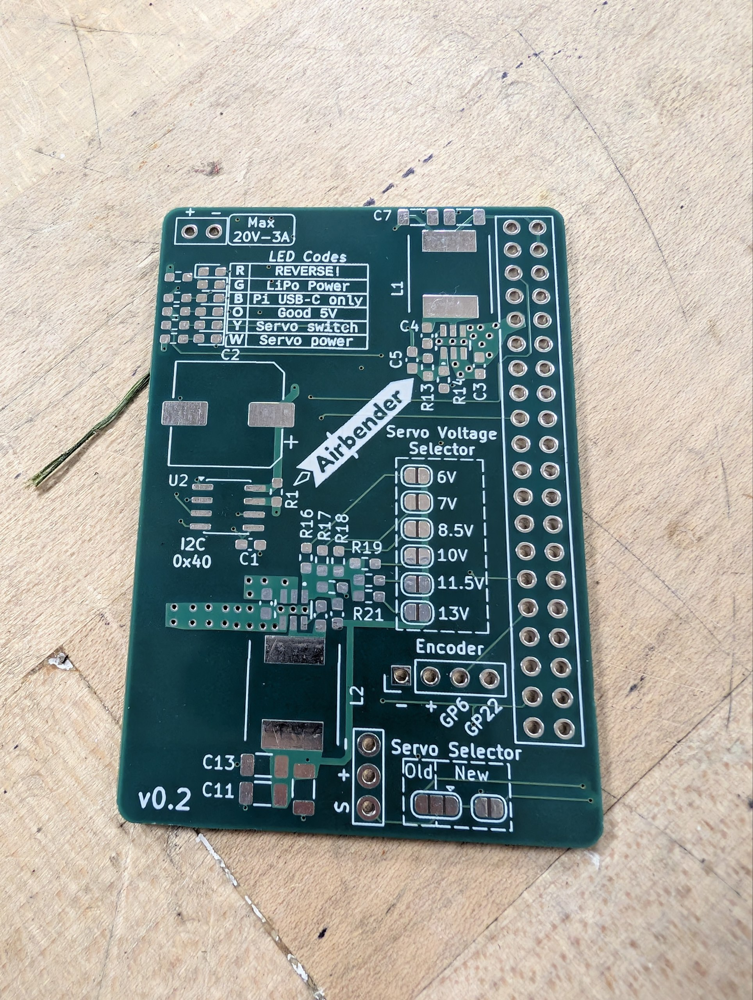
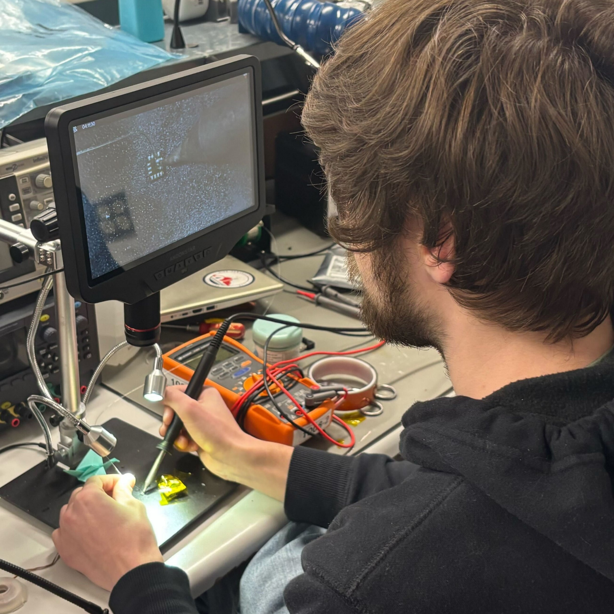
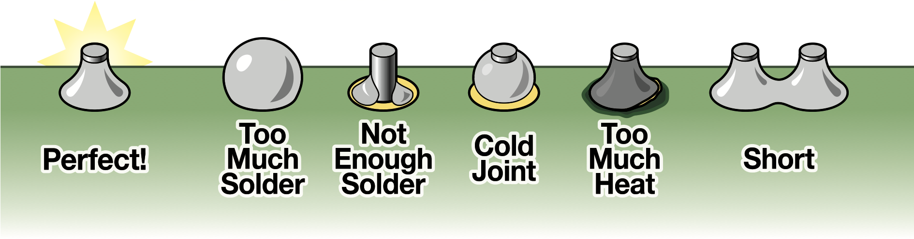
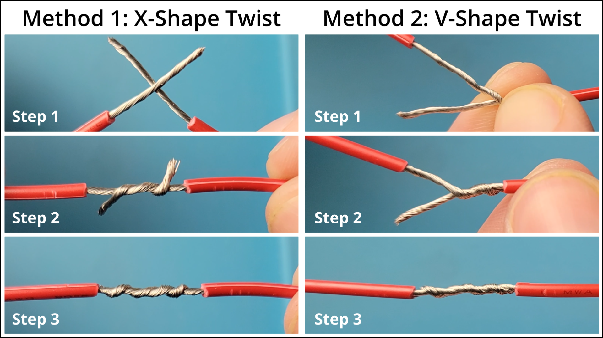

# How to Solder

There are mainly three types of soldering tasks you'll encounter: soldering SMT (Surface Mount) components, through-hole components, and joining two wires together. Each of these tasks requires a slightly different technique and approach, but the basic principles of soldering apply to all of them.

-  { width="60%" loading="lazy" }

    **PCB with SMD pads and through holes**  
    
    This PCB has both SMT pads (the small rectangular pads) and through holes (the big circular holes on the right).

-  { width="40%" loading="lazy" }

    **Person SMD Soldering**  
    
    This is the general setup for soldering SMD components. You hold the [soldering iron](tools_and_materials.md#soldering-iron) in your dominant hand and use tweezers in the other hand to position the component. Or if it's already placed, you hold the [solder](tools_and_materials.md#solder) instead.
    
    The [fume extractor](tools_and_materials.md#fume-extractor) is placed nearby to capture any fumes generated during soldering.
      

## SMT Soldering

SMD (Surface Mount Device) components are soldered directly onto pads on the surface of a PCB.

Soldering SMD components can be more challenging than through-hole components due to their small size and lack of leads, but with the right tools and techniques, it can be done effectively.

There are a few ways to solder SMD components. We cover some of the processes here:

## Single SMD component

This is the most basic method of soldering SMD components. You would use this method when you only have a few components to solder, and they are simple components, such as resistors, capacitors, or ICs whose legs are easily accessible.

!!! Warning 
    If your component has pads on the bottom (like a BGA), then you cannot use this method since you won't be able to heat the joint properly. See [this section](#single-smd-component-with-pads-on-the-bottom) for that.

**Required:**

- [Soldering Iron](tools_and_materials.md#soldering-iron)

    !!! Tip
        A fine tip such as a knife tip is recommended for SMD soldering. The sharp edge holds solder better and allows for more precise application of heat.

- [Solder](tools_and_materials.md#solder)

    !!! Tip
        Depending on how small your component or the pad is, you may want to use a thinner solder (like 0.3 mm) for better control and precision. Leaded solder can also be easier to work with for SMD soldering due to its lower melting point and better flow characteristics.

**Optional:**

- [Flux](tools_and_materials.md#flux)
- [Isopropyl Alcohol](tools_and_materials.md#isopropyl-alcohol)
- [Tweezers](tools_and_materials.md#tweezers)

**Steps:**

TODO: Insert video here.

1. Place the PCB: Secure the PCB on a stable surface, such as a [soldering mat](tools_and_materials.md#soldering-mat) or in a [vise](tools_and_materials.md#vise).
2. Prepare the PCB: Clean the PCB with isopropyl alcohol specially if there's dirt.
3. Apply flux: Using [flux](tools_and_materials.md#flux) is highly recommended. The no-clean flux is preferred over the flux pen, but either will work. Apply it directly to the pads where the component will be soldered.
4. Apply solder: Touch the [soldering iron](tools_and_materials.md#soldering-iron) tip to the pad and feed a small amount of [solder](tools_and_materials.md#solder) onto the pad. The solder should melt and form a very thin layer on the pad.
5. Place the component: Use tweezers to position the SMD component accurately on the pads.
6. Solder the component: Heat the joint by gently touching the [soldering iron](tools_and_materials.md#soldering-iron) tip to the pad and the component lead simultaneously. Since there is solder already on the pad, it should melt and form a good joint between the pad and the component lead.

## Single SMD component with pads on the bottom

For components like [QFNs](https://en.wikipedia.org/wiki/Flat_no-leads_package) or [BGAs](https://en.wikipedia.org/wiki/Ball_grid_array), the pads are on the bottom of the component, so you won't be able to heat the joint properly with a soldering iron. In this case, you can use solder paste and a [hot air rework station](tools_and_materials.md#hot-air-rework-station) to solder the component.

**Required:**

- [Solder Paste](tools_and_materials.md#solder-paste) or [Solder](tools_and_materials.md#solder)
- [Hot Air Rework Station](tools_and_materials.md#hot-air-rework-station)
- [Flux](tools_and_materials.md#flux)

**Optional:**

- [Kapton Tape](tools_and_materials.md#kapton-tape) to protect nearby components from heat
- [Tweezers](tools_and_materials.md#tweezers)

**Steps:**

=== "Using Solder Paste"
  
    1. Place the PCB: Secure the PCB on a stable surface, such as a [soldering mat](tools_and_materials.md#soldering-mat) or in a [vise](tools_and_materials.md#vise).
    2. Prepare the PCB: Clean the PCB with 99% isopropyl alcohol specially if there's dirt
    3. Apply solder paste: Use a stencil, toothpick, or a syringe to apply solder paste onto the pads where the component will be soldered.
    
        !!! Note
            Solder paste contains flux, so you don't need to apply additional flux when using solder paste. It is also okay if there are some "bridges" of solder paste between the pads, because during reflow, the surface tension of the molten solder will help to pull the solder into the correct shape and position on the pads.
      
    4. Place the component: Use tweezers to position the SMD component accurately on the pads. The solder paste will help to hold the component in place.
    5. Reflow the solder: Use a [hot air rework station](tools_and_materials.md#hot-air-rework-station) to heat the area around the component. Hold the nozzle about 1-2 inches away and move it in small circles to ensure even heating. You may see the component "pop" into place as the solder melts and forms a good joint between the pads and the component leads. This is when you can stop heating and let it cool down.
    
        !!! Tip
            - If there are nearby components that you don't want to heat, you can use [kapton tape](tools_and_materials.md#kapton-tape) to protect them from the heat.
            - You should keep the temperature of the hot air rework station about 20-30°C above the melting point of the solder paste you're using. The airflow setting is typically at the lowest in order to avoid blowing the component away, but for larger components, you may need to increase the airflow to ensure even heating.
    
    6. Verify the joint: After the solder has cooled, inspect the joint under a microscope to ensure that it is properly formed and there are no solder bridges or unflowed joints (this is almost impossible for pads under the component). If there are any issues, you can reheat the joint with the hot air rework station to fix them.
  
=== "Using Solder"

    You follow the steps outlined in the [previous section](#single-smd-component) to apply solder to the pads, but instead of using a soldering iron to heat the joint after placing the component, you use the [hot air rework station](tools_and_materials.md#hot-air-rework-station) to heat the area around the component until the solder melts and forms a good joint between the pads and the component leads. You should see the component "pop" into place when the solder melts. That's when you can stop the heat application.
    
    !!! Note
        - You should use a slightly higher temperature, around 300C for leaded solder, and about 330C for unleaded solder.
        - If your solder coat on the pad was too much, you will find that the component does not sit flat on the surface. See this [tip](soldering_tips.md#pick-up-solder) to resolve that.
    
## Soldering a whole PCB at once

Soldering a whole PCB at once is typically done using a reflow oven, which allows for precise control of the temperature profile to ensure proper soldering of all components simultaneously.

You can reflow both sides of the PCB at once if both the sides have small enough components so that they would not fall off when the solder melts due to surface tension. Any larger or heavier components should be soldered separately *after* the reflow process.

**Required:**

- [Solder Paste](tools_and_materials.md#solder-paste)
- [Reflow Oven](tools_and_materials.md#reflow-oven)

**Steps:**

1. Apply solder paste: Use a stencil to apply solder paste onto all the pads where components will be soldered. It's okay if there are some "bridges" of solder paste between the pads, because during reflow, the surface tension of the molten solder will help to pull the solder into the correct shape and position on the pads.
2. Place components: Use tweezers or a [pick-and-place machine](https://reporter.ncsu.edu/link/courseview?courseID=COE-ECE-MAKE212&deptName=COE) to position all the components accurately on the pads. The solder paste will help to hold the components in place.
3. Reflow the solder: Place the PCB in the reflow oven and run the appropriate temperature profile for the solder paste you're using. The oven will heat the PCB according to the profile.
4. Verify the joints: After the solder has cooled, inspect all the joints under a microscope to ensure that they are properly formed and there are no solder bridges or unflowed joints. If there are any issues, you can reheat the joint with a [hot air rework station](tools_and_materials.md#hot-air-rework-station) to fix them.

  
## Through-Hole Components

Through-hole components have leads that pass through holes in the PCB and are soldered on the opposite side.

**Required:**

- [Soldering Iron](tools_and_materials.md#soldering-iron)
- [Solder](tools_and_materials.md#solder)

**Optional:**

- [Flux](tools_and_materials.md#flux)

**Steps:**

1. Insert the component: Push the leads through the holes from the top side.
2. Secure: Bend the leads slightly on the bottom to hold the component in place.
3. Heat the joint: Touch the [soldering iron](tools_and_materials.md#soldering-iron) tip to the lead and pad simultaneously.
4. Apply solder: Feed [solder](tools_and_materials.md#solder) wire into the joint with your other hand until it flows and fills the hole.
5. Remove heat: Pull away the iron, then the solder wire.
6. Trim leads: Use cutters to remove excess lead length.

!!! Tip
    If the solder doesn't flow well, you can apply a small amount of [flux](tools_and_materials.md#flux) to the joint to improve the flow and quality of the solder joint.

!!! Info
    { width="70%" loading="lazy" }

     A good through-hole solder joint should have a small, shiny, volcano-shaped appearance on the PCB.

## Two Wires Together

Joining two wires creates a secure electrical connection, often for repairs or extensions.

**Required:**

- [Soldering Iron](tools_and_materials.md#soldering-iron)
- [Solder](tools_and_materials.md#solder)
- [Wire Strippers](tools_and_materials.md#wire-strippers)

**Optional:**

- [Flux](tools_and_materials.md#flux)
- [Heat-Shrink Tubing](https://en.wikipedia.org/wiki/Heat-shrink_tubing)
- [Helping hands](tools_and_materials.md#helping-hands) or [vise](tools_and_materials.md#vise)

=== "Stranded Wires"
  
    For stranded wires, you first need to twist the strands together to create a solid connection before soldering. Stranded wires are more flexible and less prone to breaking than solid wires, but they can be more difficult to solder if not twisted together properly.

=== "Solid Wires"

    For solid wires, you can either twist the two wires together or place them on top of each other if you can't twist them. Solid wires are easier to solder but less flexible than stranded wires.

**Steps:**

1. Strip insulation: Use [wire strippers](tools_and_materials.md#wire-strippers) to expose about 1/2 inch of bare wire on each end.
2. Pass the wires through heat-shrink tubing: If you plan to use heat-shrink tubing for insulation, make sure to slide it onto one of the wires before twisting and soldering.
3. Clamp: Use [helping hands](tools_and_materials.md#helping-hands) or a [vise](tools_and_materials.md#vise) to hold the wires in place while soldering.
4. Twist or place on top each other: Either way is fine, but make sure the wires are in good contact with each other to ensure a strong solder joint.

    { width="60%" loading="lazy" }

5. Apply flux: Dab [flux](tools_and_materials.md#flux) on the twisted wires to improve flow.

6. Apply solder: Use the soldering iron and solder on the joint until it flows into the twists.

!!! Tip
    You can also use a soldering iron to pre-tin (i.e. apply a thin layer of solder to) the wires before twisting them together. This can help to ensure a stronger joint and make the soldering process easier.
