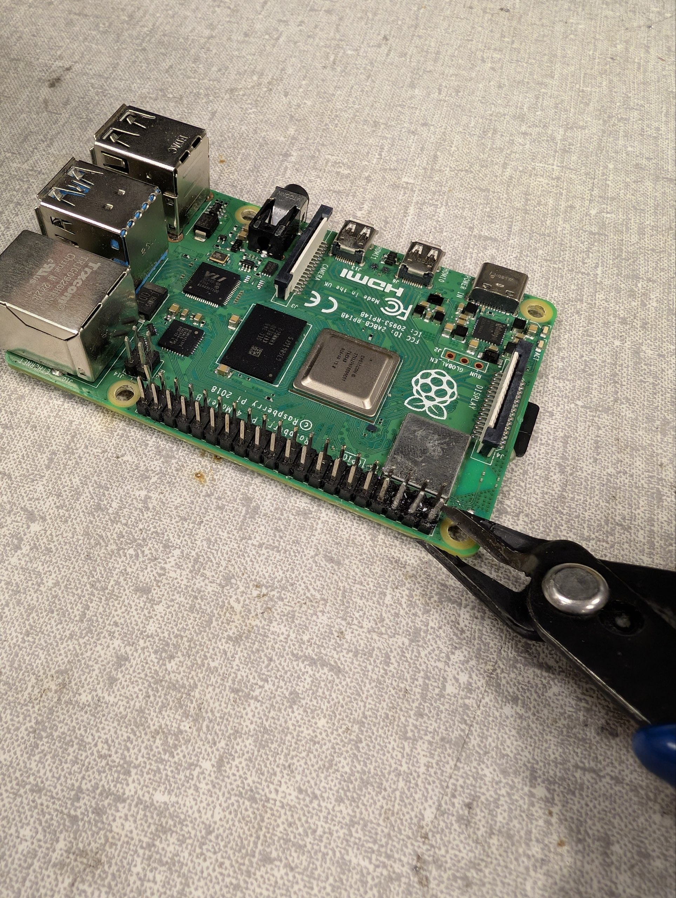

# Soldering Tips

## Pick up solder

Instead of holding the solder wire in your hand, you can put some solder directly on tip of the soldering iron. This allows for better control and precision when applying solder to small joints or SMD pads and also frees up your other hand to hold tweezers.

!!! Warning
    If you take too long to apply the solder after picking it up with the iron, the solder may quickly oxidize and harden. If this happens, you can simply wipe the tip on [brass wool](tools_and_materials.md#brass-wool) to remove the oxidized solder and pick up fresh solder again.

!!! Danger
    Be careful not to apply too much solder on the tip, as it can create large blobs that are difficult to control and may fall down, likely burning you.
    
## Cutting solder wick

If you don't cut the solder wick from the roll, the excess wick can act as a heat sink and prevent the wick from heating up properly, which can make it less effective at absorbing solder. Always cut a small piece of wick for each use to ensure optimal performance.

## Abundance of flux

You can always apply more flux if the solder isn't flowing well. There is almost no such thing as "too much flux" when it comes to soldering, since the excess flux can be cleaned off with isopropyl alcohol after soldering. So if you're having trouble getting the solder to flow, just apply more flux and it should help.

!!! Note
    If using more flux is still not working, consider the possibility that the soldering iron tip is oxidized and not transferring heat properly. In this case, you can use [tip tinner](tools_and_materials.md#tip-tinner) to restore the tip's performance.

## Heat set inserts

When soldering heat set inserts into 3D printed parts, use a very low temperature, and try to use a "throw away" soldering iron, since heat set inserts have damaged the tips previously. Apply light pressure and heat the insert until it can be pressed into the hole. This can take a few seconds per insert.

## Tip Tinning

Before and after you finish soldering, always apply a fresh coat of solder to the tip of the soldering iron. This is called "tinning" the tip, and it helps to protect the tip from oxidation and maintain good heat transfer. This should be done regularly during soldering sessions to keep the tip in good condition.

## Cracked Capacitors

While soldering SMD capacitors, specially of the 1206 package, you should almost never hand solder them. The heat from the soldering iron on one side can easily crack them internally, which is only visible under x-ray. A NASA paper found that around 50% of 0603 capacitors crack and fail electrically even when carefully hand soldered, and 1206 capacitors are even more susceptible to cracking.

Cracked capacitors can cause intermittent failures that are very difficult to debug, and can be very frustrating to deal with.

So what should you do? Use a [hot air rework station](tools_and_materials.md#hot-air-rework-station) to pre-heat the capacitor to around 150°C. You can then use the soldering iron to solder the capacitor while the board is still hot. Try to use the lowest temperature possible on the soldering iron, perhaps just 10-15°C above the melting point of the solder, and minimize the time the soldering iron is in contact with the capacitor.

This [paper](https://nepp.nasa.gov/files/16346/08_002_01%20GSFC%20Teverovsky.pdf) goes more into detail on the specific failure modes and testing methodology if you're interested in learning more.

## Desoldering an entire column of Raspberry Pi headers

Have you ever wanted to desolder an entire column of headers on a Raspberry Pi? Fret not, this short guide will cover how to effectively desolder the headers, removing all the solder from the through hole.

**Required:**

1. [Wire cutters](tools_and_materials.md#wire-cutters)
2. [Hot Air Rework Station](tools_and_materials.md#hot-air-rework-station)
3. [Tweezers](tools_and_materials.md#tweezers)
4. [Solder Sucker](tools_and_materials.md#solder-sucker)
5. Safety glasses: There will be plastic travelling at high velocities, so make sure to protect your eyes.

**Optional:**

1. [Flux](tools_and_materials.md#flux)

**Steps:**

-   { width="30%" loading="lazy" }

    **Snipping the pins with wire cutters**

    Cut as close to the board as possible, but be careful not to damage the PCB. Wear safety glasses since the pin will fly towards a random direction.
    

1. Use the [wire cutters](tools_and_materials.md#wire-cutters) to cut the plastic of the pins. This process is destructive, so make sure you don't need those particular headers anymore before doing this.

2. You will notice that the only thing left are small sections of the pins that are still soldered to the board and hard to cut with the wire cutters.

3. Use the [hot air rework station](tools_and_materials.md#hot-air-rework-station) with a small nozzle to heat the through hole where the pin is located. You can apply some [flux](tools_and_materials.md#flux) to help the heat transfer and solder flow.

4. Use the solder sucker while the solder is molten to suck up most of the solder from the through hole. You may repeat this process a few times until most of the solder is removed. Try to the solder out from both sides of the through hole to maximize the amount of solder removed.

5. You may find that there is still some solder left in the through hole, which even the solder sucker cannot seem to remove.

6. This is where the tweezers come in. While the solder is still molten from the hot air rework station, use the sharp end of the tweezer to poke into the through hole. The solder may stick to the tweezer, or may fall out of the through hole. 

7. You now repeat this process for every through hole. In the end, you will notice that all the through holes are completely clear of solder, and look brand new!
