# Tools and Materials

There are several tools and materials that you will need for soldering. Here are some of the most common ones:

## Solder

Solder is a metal alloy, often made of tin and optionally, lead. It comes in the form of a thin wire or a paste and is used to create a strong bond between electronic components.

The solder we have in the lab also has a [flux core](#flux) within it, so you may not need to add flux separately for some applications.

Here are 3 types of solder we have in the lab:

**Unleaded 0.3 mm**

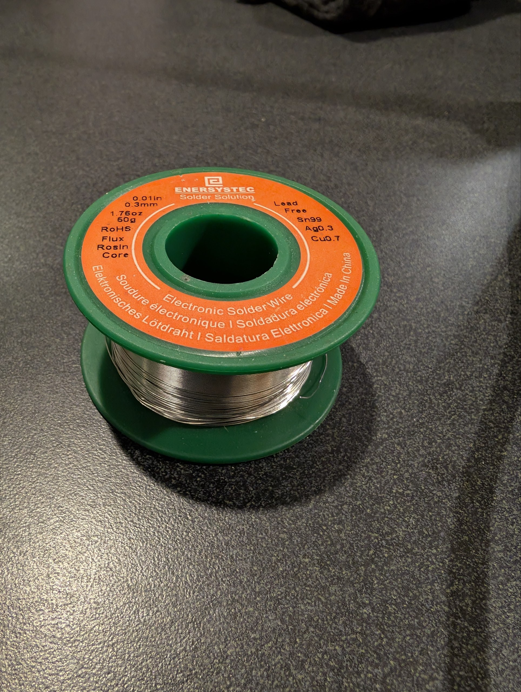{ width="60%" loading="lazy" }

Fine pitch work, high melting point

**Leaded 0.8 mm**  

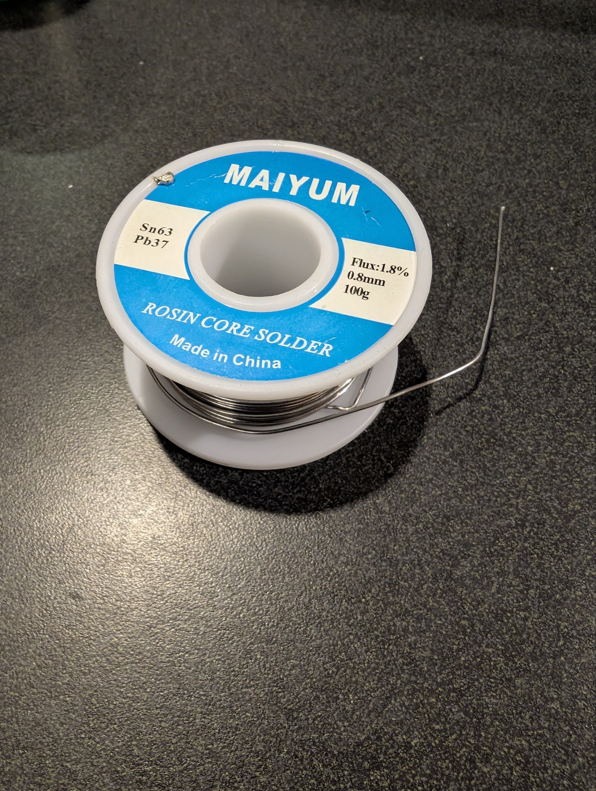{ width="60%" loading="lazy" }

Lower melting point, much more easier to work with

**Solder paste**  

{ width="60%" loading="lazy" }

A thick paste used for soldering surface mount devices (SMDs). Usually at a much lower melting point (< 200°C). Requires a [reflow oven](#reflow-oven) or [hot air rework station](#hot-air-rework-station).

The choice between leaded and unleaded solder depends on personal preference. It is much easier to work with leaded solder since it has a lower melting point and better flow characteristics. 

!!! warning "Lead Safety"
    Leaded solder contains lead, which is toxic. Always **wash** your hands after handling leaded solder, since there are fine particulates that can settle on your fingers. Always use a [fume extractor](#fume-extractor) when soldering to avoid inhaling flux fumes.

## Soldering Iron

A soldering iron is a handheld tool that heats up to melt [solder](#solder). It typically has a pointed tip that allows for precise application of heat to the components being soldered.

We have 2 good soldering irons in the lab:

-  { width="70%" loading="lazy" }

    **TC 22 Soldering Station**  
    Digital display, extremely fast heat up time, should be the go-to soldering iron.

- { width="70%" loading="lazy" }

    **Pinecil Soldering Station**  
    Compact, portable, and USB-C powered (needs a good 35W+ PD cable).

**Temperature Settings:**

- For leaded solder, set the temperature to around 280-310°C.
- For unleaded solder, set the temperature to around 320-350°C.

## Flux

Flux is a chemical agent that helps to clean, remove oxides, promotes wetting, and improves the flow of [solder](#solder) and the quality of the joint. It can come in various forms, such as liquid, paste, or as a core in solder wire.

We have 3 types of flux in the lab:

**Flux pen**

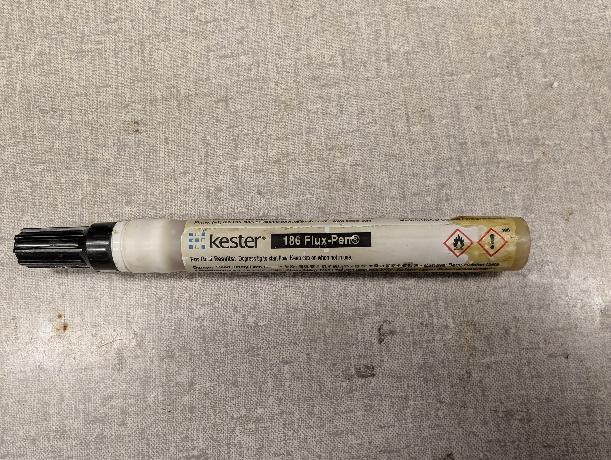{ width="70%" loading="lazy" }

Depress the tip to release flux, needs cleaning after soldering

  

**No-Clean Flux**

{ width="70%" loading="lazy" }

Suitable for general use, does not require cleaning after soldering.

**Flux Paste**

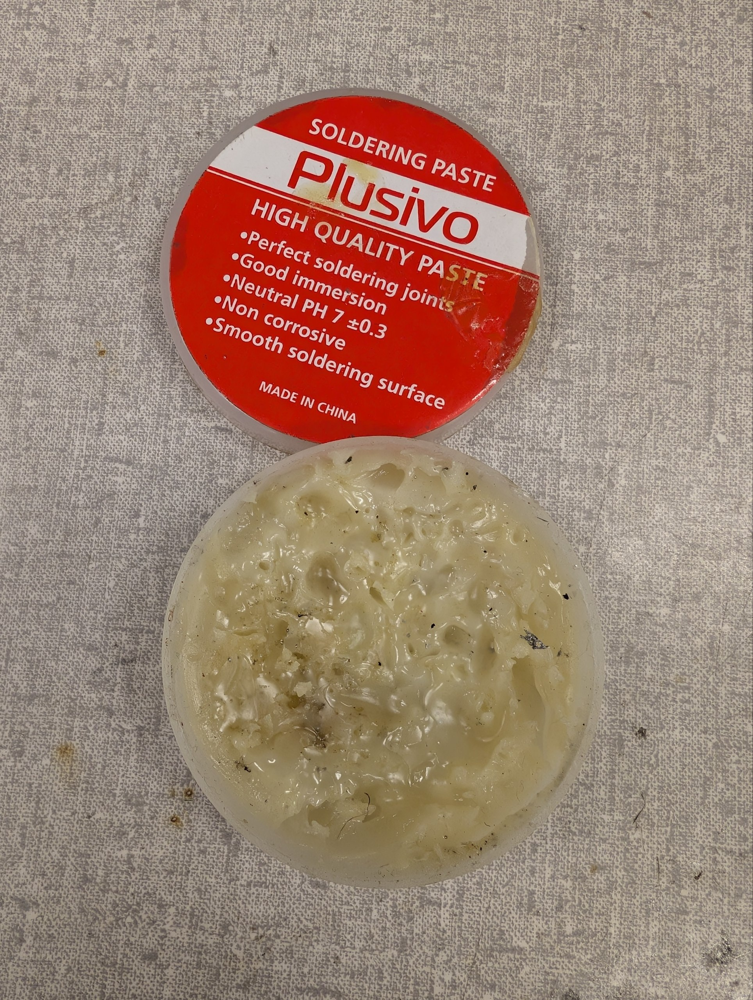{ width="50%" loading="lazy"}

Flux paste which is typically used for [soldering wires together](how_to_solder.md#two-wires-together)

## Solder Wick

Solder wick, also known as desoldering braid, is a braided copper wire that is used to remove excess [solder](#solder) from a joint. It works by absorbing the molten solder when heated with a [soldering iron](#soldering-iron).

-  { width="60%" loading="lazy" }

    **Solder Wick**  
    The copper braid absorbs molten solder

## Solder Sucker

A solder sucker, also known as a desoldering pump, is a handheld tool that creates suction to remove molten [solder](#solder) from a joint. It typically consists of a plunger and a nozzle that can be placed over the molten solder to be removed.

-  { width="70%" loading="lazy" }

    **Solder Sucker**  
    Press down the red push head of the plunger to create suction, place the nozzle over molten solder, and hit the release button to suck up the solder.

-  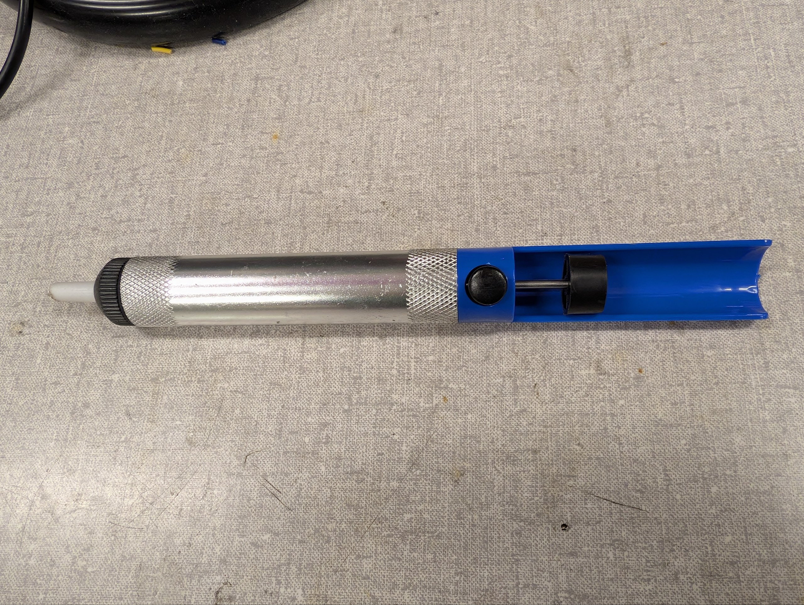{ width="70%" loading="lazy" }

    **Old Solder Sucker**  
    A more traditional design - can be less effective since the suction isn't as strong.

## Fume Extractor

This is a simple centrifugal fan which when turned on, creates negative pressure to pull in the fumes generated during soldering. There is an activated carbon filter inside the fume extractor which adsorbs the fumes before releasing the air back into the environment.

-  { width="50%" loading="lazy" }

    **Fume Extractor**  
    Simply turn it on and place it near your soldering work to capture the fumes.

## Tip Tinner

Tip tinner is a maintenance product for soldering iron tips. It typically contains flux and a sacrificial [solder](#solder)/metal compound that helps remove oxides and restores the plated surface of a tip.

This is only used as a last resort if your soldering iron tip is oxidized and not wetting properly. Should be used sparingly.

-  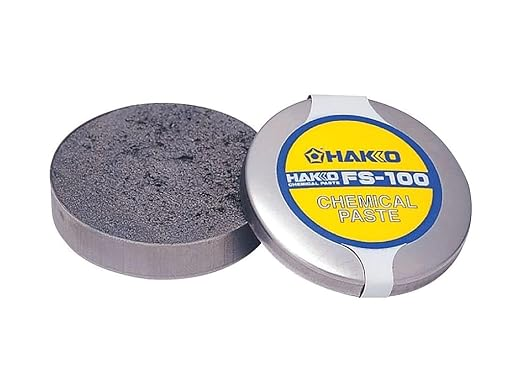{ width="40%" loading="lazy" }

    **Tip Tinner**  
    Simply heat the soldering iron tip and dip it into the tip tinner compound.

## Kapton Tape

Kapton tape is a polyimide film tape with excellent heat resistance and electrical insulation properties.

You apply the tape in areas of a PCB you don't want heated from a [soldering iron](#soldering-iron) or [hot air rework station](#hot-air-rework-station). Our tape is rated for 250°C.

-  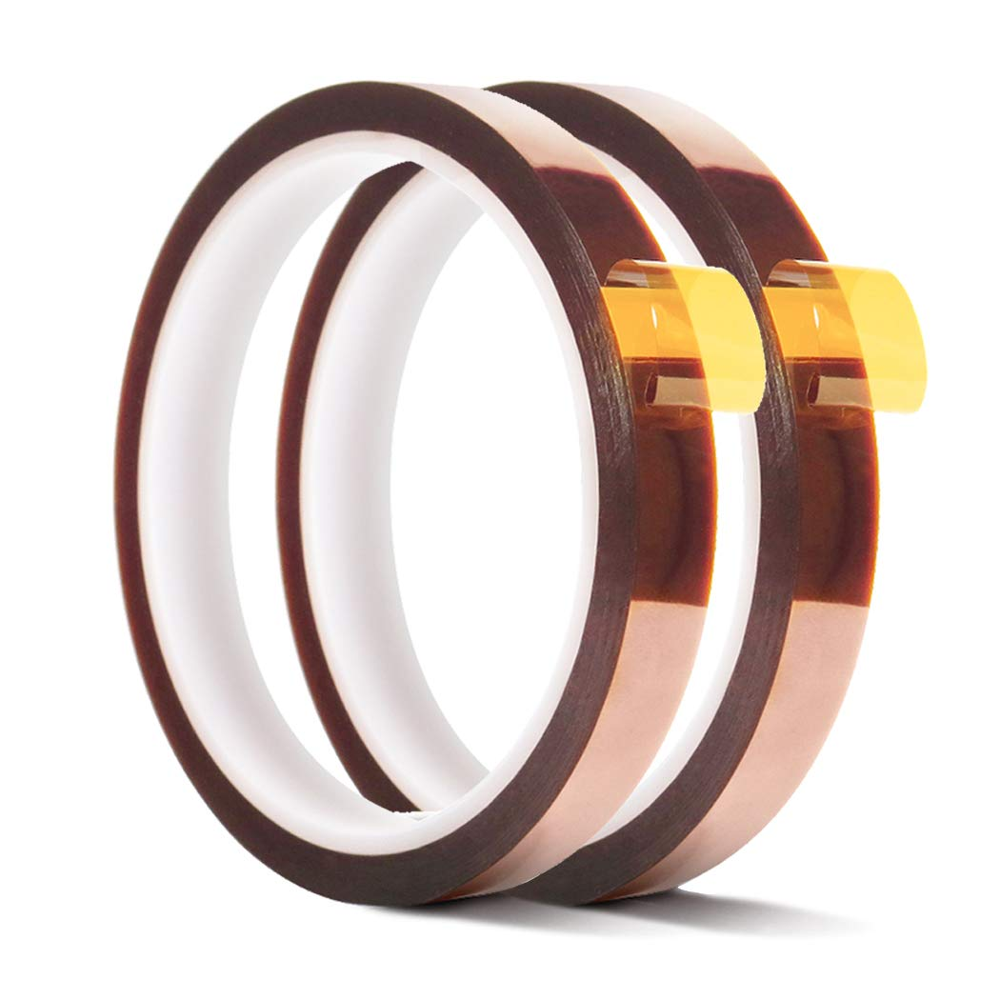{ width="50%" loading="lazy" }

    **Kapton Tape**  
    High-temperature insulating tape commonly used in SMD work.

-  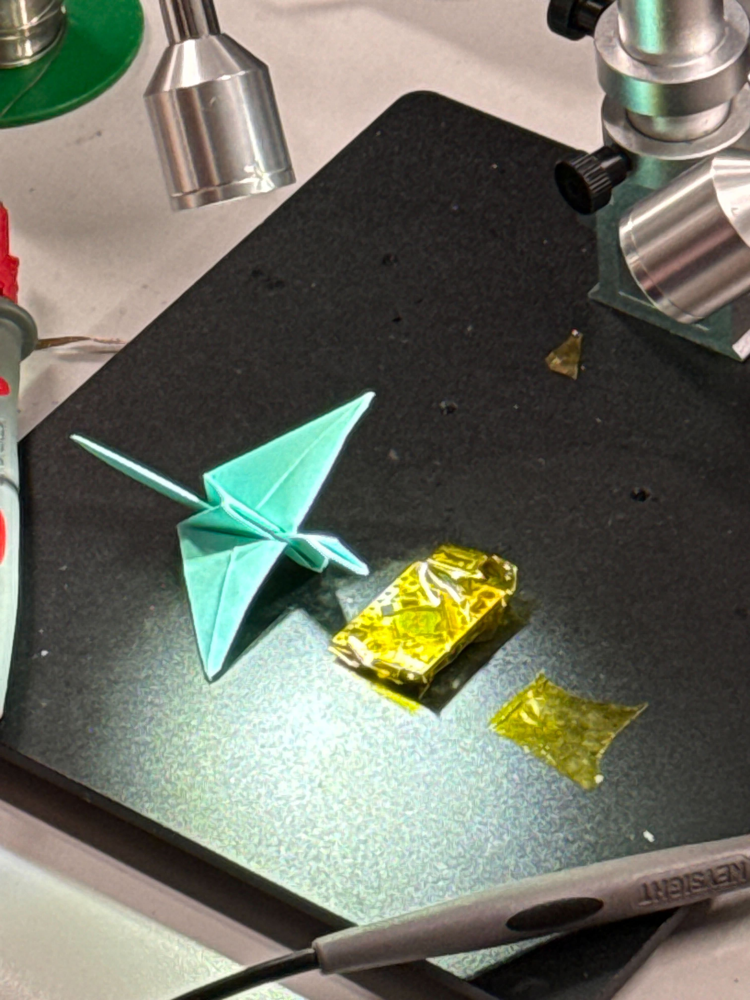{ width="40%" loading="lazy" }

    **Kapton Tape on FIRM**  
    Real world use of kapton tape while reworking on a [FIRM](../../firm/firm.md).

## Hot Air Rework Station

A hot air rework station uses a heated stream of air to melt [solder](#solder), allowing removal and replacement of surface-mount devices (SMDs), reflowing solder paste, and performing heat-based repairs (e.g., heat-shrink tubing).

-  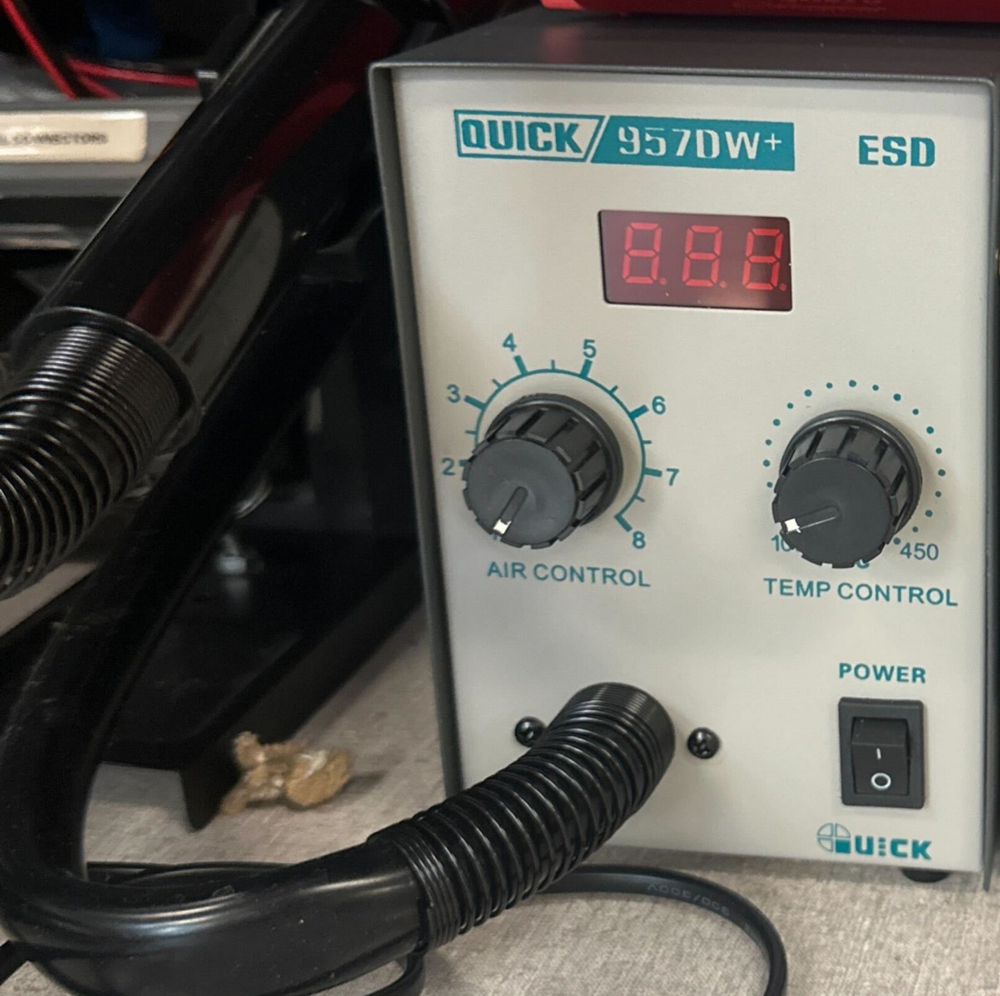{ width="40%" loading="lazy" }

    **Hot Air Rework Station**  
    The hot air rework station we have. You can control the temperature and airflow, and use different nozzles as well.

- 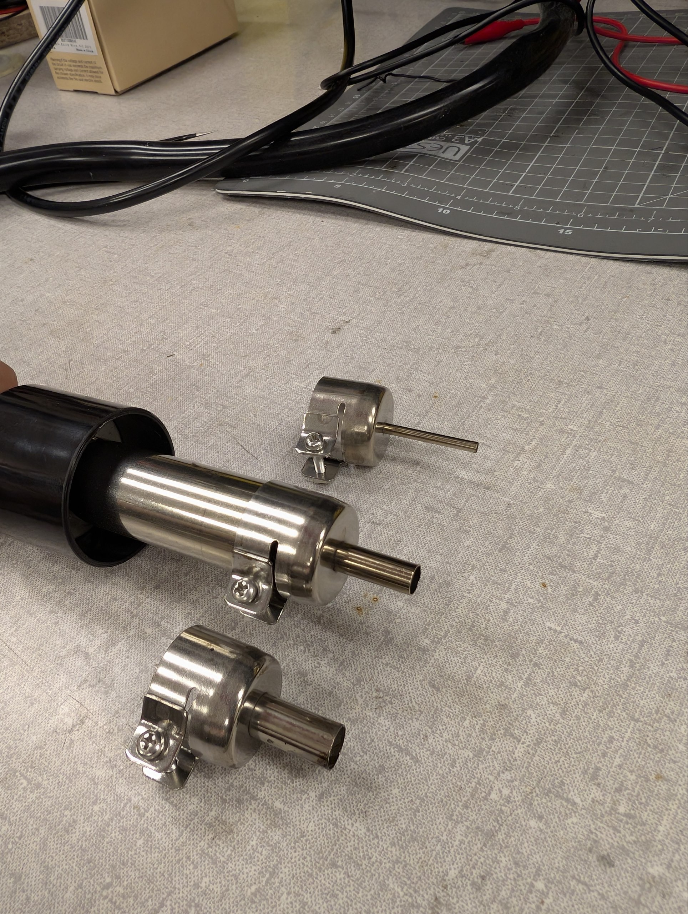{ width="40%" loading="lazy" }

    **Different Nozzles**

    Different nozzles you can attach for the hot air gun. We have small, medium, and large nozzles. You can use different nozzles for different applications.

## Reflow Oven

A reflow oven is a specialized piece of equipment used for soldering surface-mount devices (SMDs) to printed circuit boards (PCBs). It provides precise control over the temperature profile, allowing for consistent and reliable soldering of all components simultaneously.

-  { width="40%" loading="lazy" }

    **Reflow Oven**  

    The reflow oven present in the [ECE Makerspace](https://my.ece.ncsu.edu/makerspace/training/). You can set the temperature profile according to the solder paste you're using, and it will heat the PCB accordingly.

## Miscellaneous

Miscellaneous tools that can be helpful for soldering include:

### Helping Hands

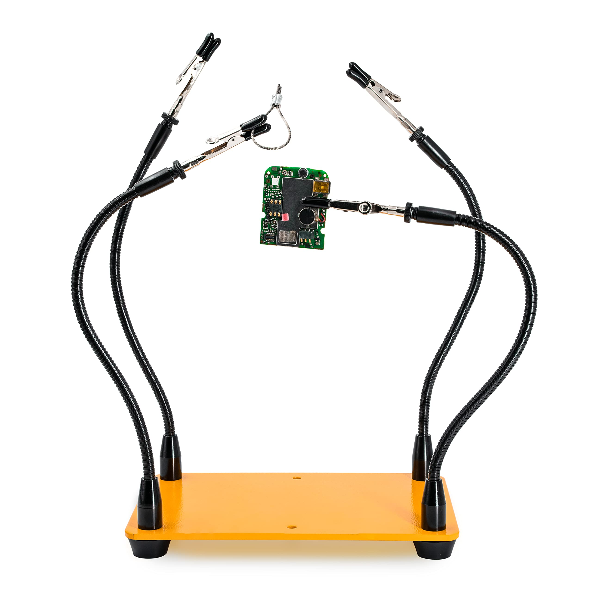{ width="50%" loading="lazy" }

Plate with 4 adjustable arms with alligator clips, used to hold components, wires, or PCBs in place while soldering. Feels like having an extra hand.

### Vise

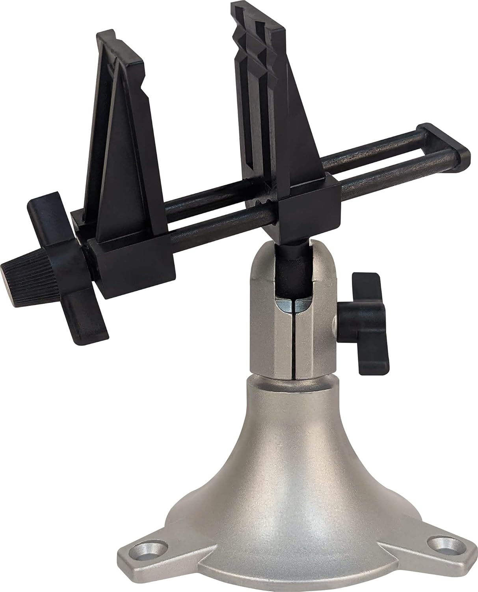{ width="40%" loading="lazy" }

A more heavy-duty option for holding PCBs or components in place while soldering.

### Tweezers

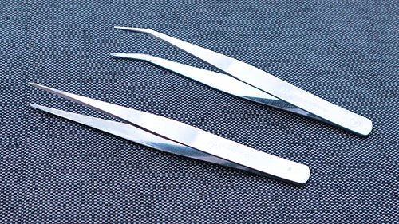{ width="60%" loading="lazy" }

Tweezers are essential for handling small components, especially SMDs. They allow for precise placement and adjustment of components during soldering.

### Isopropyl Alcohol

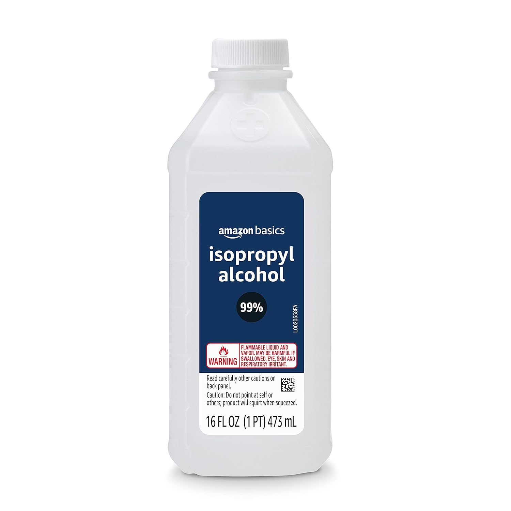{ width="40%" loading="lazy" }

Isopropyl alcohol is used for cleaning PCBs and removing flux residue after soldering. Always use 99% isopropyl alcohol for cleaning PCBs.

### Wire Strippers

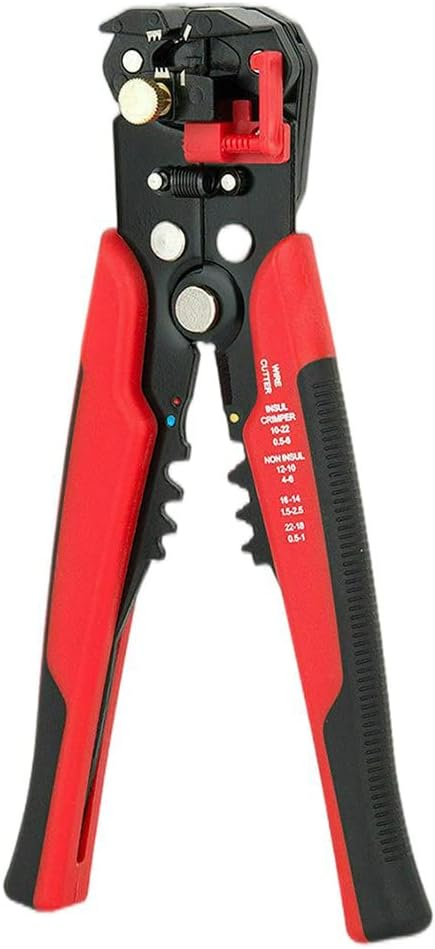{ width="20%" loading="lazy" }

Wire strippers are used to remove the insulation from wires before soldering them together or to a PCB. To strip a wire, just place the it on the top and squeeze the handles.

### Brass Wool

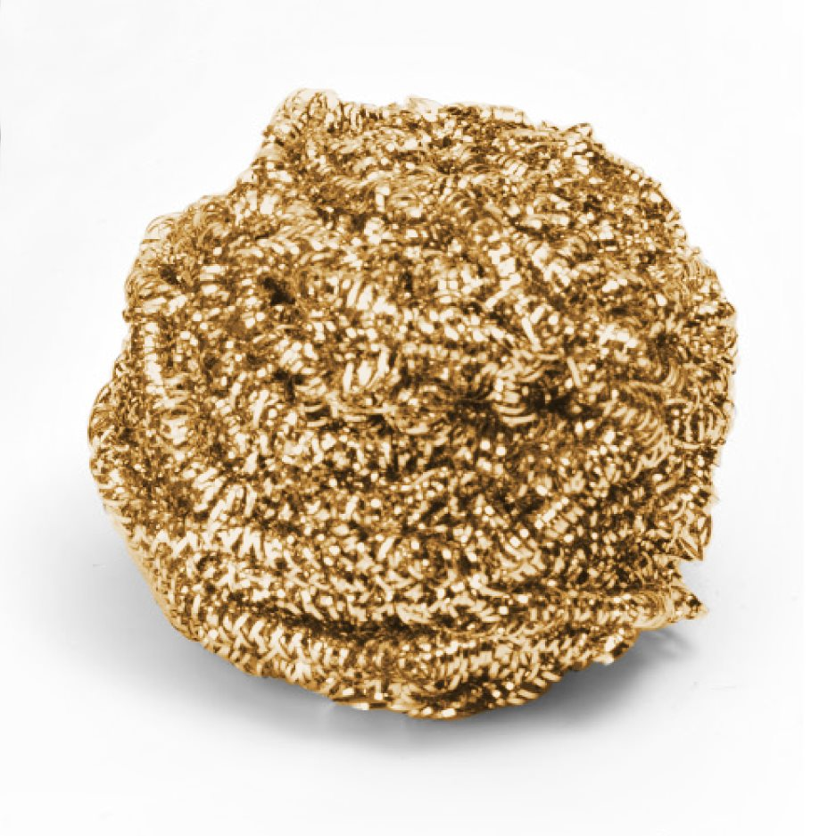{ width="40%" loading="lazy" }

Brass wool is used for cleaning soldering iron tips. It removes the oxidation layer on the tip. Always rub the iron tip on the brass wool before and after soldering to maintain the tip.

### Microscope

{ width="25%" loading="lazy" }

This microscope goes up to 1000x magnification. Focus is controlled by the knob on the bottom, and the arm height can be adjusted by the knob on the side.

### Soldering Mat

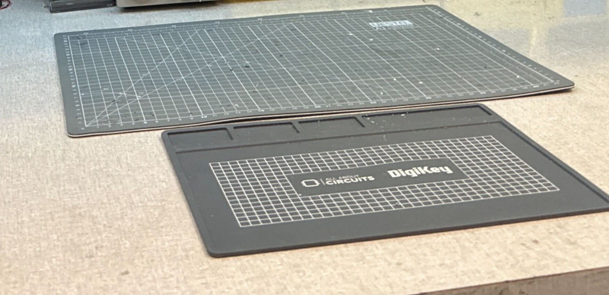{ width="40%" loading="lazy" }

A soldering mat is a heat-resistant surface that provides a safe and organized workspace for soldering. We have 2 mats. The Digikey mat is preferred since it is made of silicone.

### Brushes

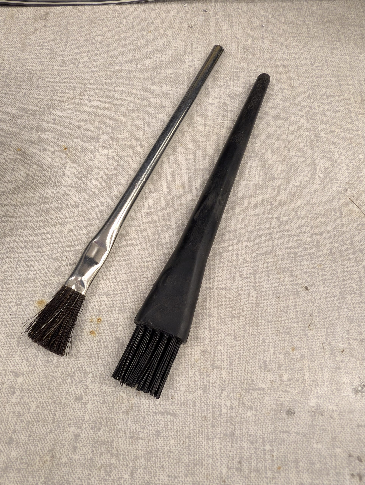{ width="30%" loading="lazy" }

Use this brush along with [IPA](#isopropyl-alcohol) to clean your wires or PCB.

