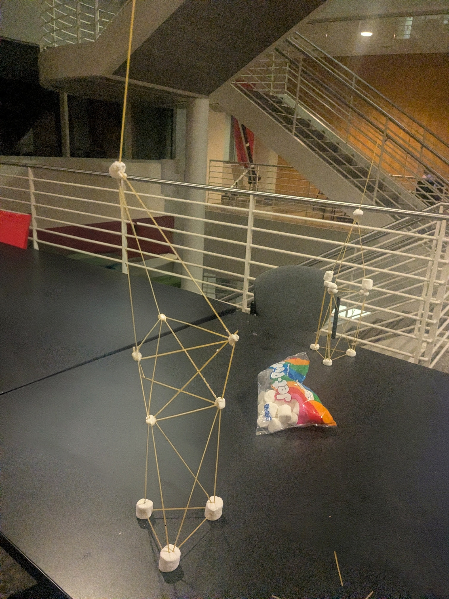

# Spaghetti launch stand

The spaghetti launch stand event is a new event as of 2025 and is always paired with a presentation. After presenting you will have the students compete to make the tallest launch stand out of spagetti straws and marshmallows. 

This event is paired with a [presentation](presentations.md) that can be found the in Outreach Drive. 

-  { width="60%" loading="lazy" }

    **Spaghetti Tower**  
    An example of a tower students might build at an event

## Items needed

**Required**

- Spaghetti
- Marshmallows
- Wet wipes (To clean the area afterwards)
- Tape measure
- Everything needed from [presentations.md](presentations.md)

**Optional**

- Rockets
- Past Payloads
- Table cloths

## Running the event

This is a lengthier event with at least one hour needed to run the event.
To run this event start by giving a presentation about the club and launch towers before transitioning into the activity. For the activity give every group of students 20 spaghetti Straws and 5 Large Marshmallows. Allow 20 minutes for building and measure their towers whenever they are ready.