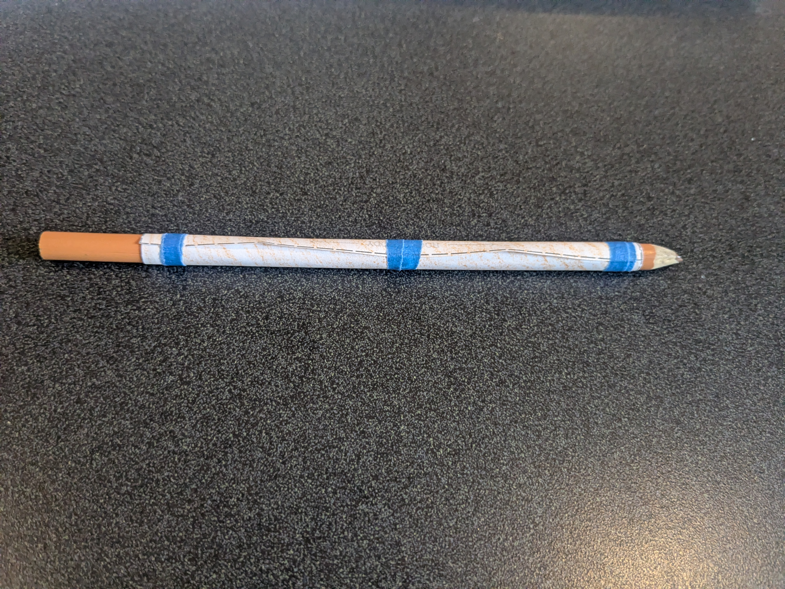
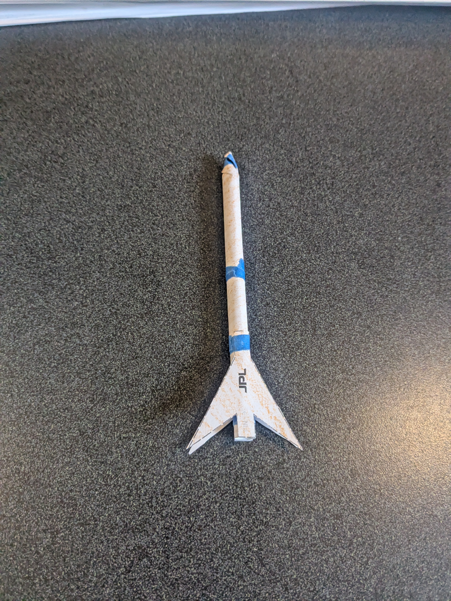

# Straw Rockets

Straw rockets are rockets made from a rolled tube of paper and taped to form a body tube. After making the body tube fins and a nosecone are added. To launch the straw rocket it is placed on a straw which you blow on to launch the rocket. This is a very frequently ran event; ran most often at tabling events (i.e. Astronomy Days) and at elementary and middle schools paired with a presentation.

## Items needed

**Reqired:**

- Straw Rocket templates
- Scissors (at least 8 pairs)
- Tape
- Colored Pencils
- Straws

**Optional**

- Rockets
- Past Payloads
- Table Cloth

## Running the event

Straw rocket events are normally run in two different ways. 

=== "Free flowing events"
  
    Free flowing events are events in which you are located at a table of a larger event. This can include: STEM days, Astronomy Days (North Carolina Museum of Natural Sciences), Engineers Day (Life and Science Museum), and more. For free flowing events you will often go through 300-400 straw rocket templates and straws at every event. 

    Depending on the age of the kids you will often end up cutting out and making the straw rocket for them. 

  
=== "School presentations"

    School presentations are another common event where we make straw rockets. At school presentations you will start by doing a presentation before breaking up into classrooms to make the straw rockets. This event will need 4+ people so every classroom can have someone help explain and make straw rockets. 

    Leave at minimum 25 minutes to make the straw rockets and give time for cleanup. 

## Making a straw rocket

**Step 1**

{ width="60%" loading="lazy" }

Color in a blank straw rocket template

**Step 2**  

{ width="60%" loading="lazy" }

To make a straw rocket start by cutting out around the dotted lines. You should be left with one body tube and two fins.

**Step 3**  

{ width="60%" loading="lazy" }

Take the body tube and roll it around a colored pencil putting a piece of tape on the top, middle and bottom forming a long cylinder. 

**Step 4**  

{ width="60%" loading="lazy" }

Put the top of the tube to be located at the tip of the colored pencil and twist the paper to form a nosecone around the tip of the pencil. 

**Step 5**  

{ width="60%" loading="lazy" }

Tape on both fins on either side of the body tube. 

You now have a completed straw rocket.

    