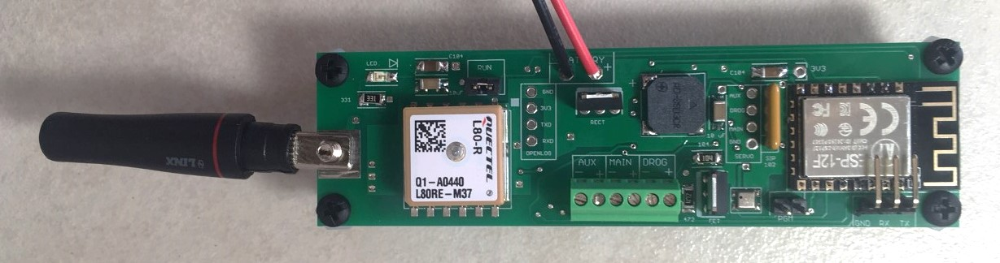
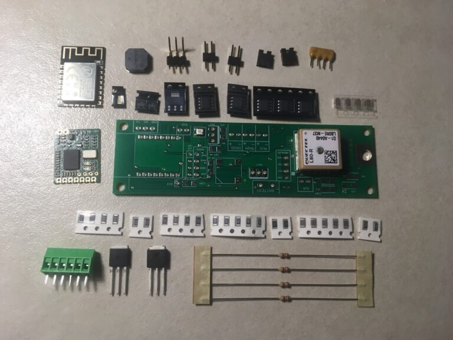
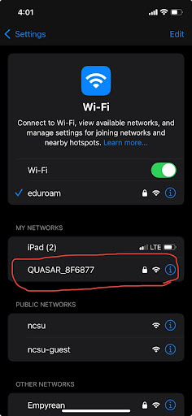
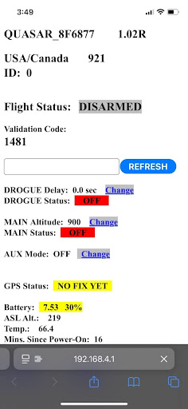

# Quasar

As one of the lowest priced COTS Altimeter-Tracker combo for hobby rocketry, the **[Eggtimer Quasar](https://eggtimerrocketry.com/home/altimeters-av-bay/){target=_blank}** is a WiFi-enabled device that allows for charge deployment, stage ignition, and live GPS tracking and telemetry.

Like all Eggtimer products, the device come unassembled, requiring the user to solder all components. Quasar assembly [guide](https://eggtimerrocketry.com/eggtimer-quasar-support/){target=_blank}.

The Quasar does not have a built in physical power switch. Instead it comes with the WiFi module which has a *WiFi switch*, meaning you can arm and disable the altimeter without needing to turn or press a physical switch. Rocketry associations like TRA and NAR do consider this switch sufficient for safety purposes, but some (including Tacho Lycos) prefer an additional physical switch for an additional level of safety. Since there are no terminal blocks for a physical switch, it is necessary to solder your physical switch in series with your battery connector.

The CAD file for the Quasar can be found [here](https://drive.google.com/file/d/1PR2ZmyRTRtak5FnZXIlF_6ybPMGH0vzY/view?usp=sharing).

## Programming

The Eggtimer Quasar must be programmed digitally using the built-in WiFi module. Since WiFi access is needed, all Quasar's are password protected. The WiFi network name will follow the scheme of QUASAR_XXXXXX, and the password will be written on a sticker attached to the bag the altimeter is shipped in, so do **not** lose the bag. The WiFi name and password for the Tacho Lycos owned Quasar is saved in the Guide folder in the club drive's admin folder.

Parts needed:
* Eggtimer Quasar
    + The other end of your battery pigtail should have the needed battery connector 
* 2s LiPo (minimum 500 mAh)
* Physical switch (optional)

1. Plug the LiPo into the Quasar battery port. Please make sure the connectors are oriented correctly so that the red and black wires line up with each other. If using a switch, close the circuit (i.e. pulling the pin, putting the screw in, etc.). The Quasar should make a series of beeps while booting up.

2. After the Quasar has booted up, open whatever mobile device you are using to connect to the Quasar. The Quasar should appear in the Other Networks section (or My Networks if you’ve connected to the Quasar before), followed by an underscore and a string of characters.

These characters vary for every Quasar, but the club one should always be the same set of characters, which is listed in the Important Info section of this guide. Select the Quasar and connect to its WiFi, using the password also listed in Important Info.

3. After connecting to this WiFi, go to your device’s search browser, and search for the ip 192.168.4.1. This should take you to the site for your Quasar’s settings, and you should see the same code as the WiFi shown at the top.

4. You can now change your settings for Drogue and Main by hitting the Change button next to their respective settings. DROGUE Delay is the time after apogee that the drogue channel will be powered, in seconds, and MAIN Altitude is the altitude, in feet, where the main channel will be powered.

5. In addition to programming the charges, you can also view the status of the GPS here. Please refer to the relevant sections if you intend to test the GPS before continuing to step 6.

6. After finishing with the Quasar, disconnect from the Quasar’s WiFi and close the circuit if you are using a switch. If you are no longer using the altimeter, unplug the LiPo from the altimeter. If the LiPo is the one you intend to use on the field, please check that the battery is fully charged or plug the battery into the charger.
* If the battery is plugged in, DO NOT leave it unattended. The LiPo should be removed as soon as it is fully charged, do not leave it on the charger.

## Programming HAM-Capable Quasar

More details to come.

## Quick Guide
Quick checklist for Quasar on the pad

1. Ensure all personelle are wearing safety glasses
2. Power on the Quasar with a physical switch (if applicable)
3. Connect to the Quasar WiFi on a phone or computer
4. Go to [194.168.4.1](https://194.168.4.1){target=_blank} in your browser
5. Check for continuity in drogue and main
6. Ensure events are programmed to the correct altitudes
7. Arm altimeter by typing in arming code
8. Power on the Eggfinder LCD Receiver or Eggfinder Dongle Receiver
9. Wait for fix
10. Disconnect from WiFi, ensure GPS packets are being sent
    - You will not receive real-time GPS packets until disconnecting from WiFi
11. Ready for launch

---
*Created by Alex K.*
*Last Edited by Aidan M. on 05/01/26*
<!-- Last Updated: 05/01/26 -->
<!-- Last Updated By: Aidan McCloskey -->