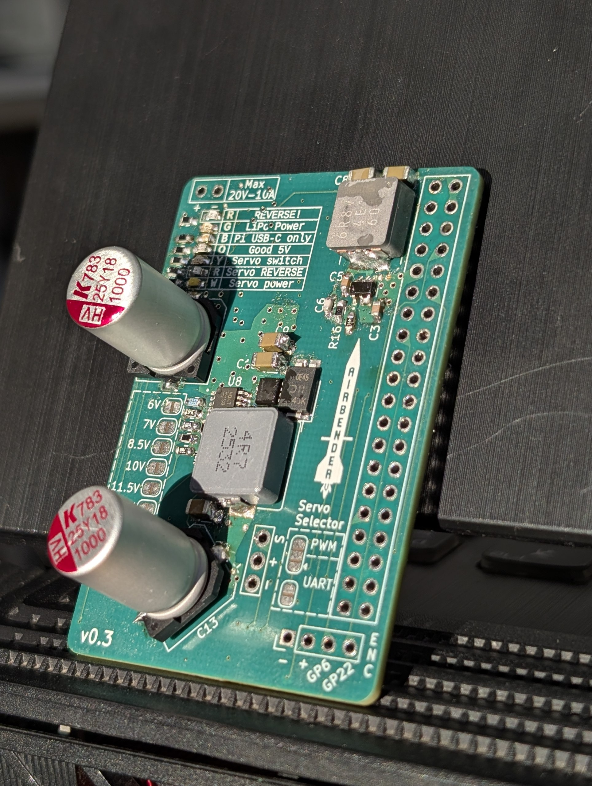
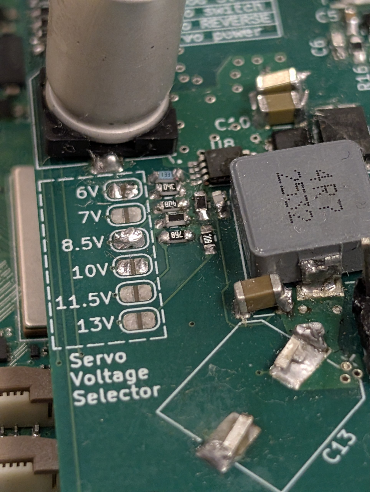
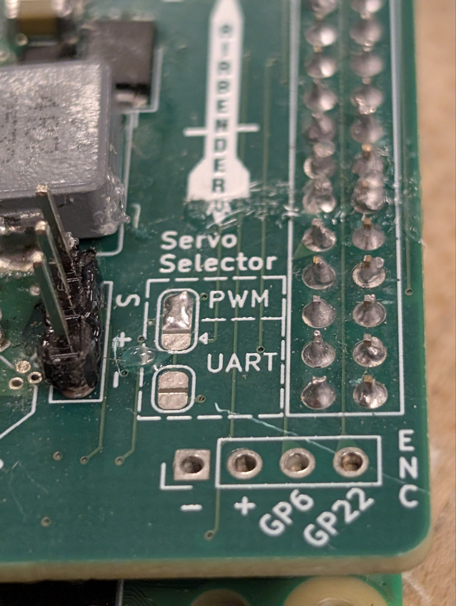
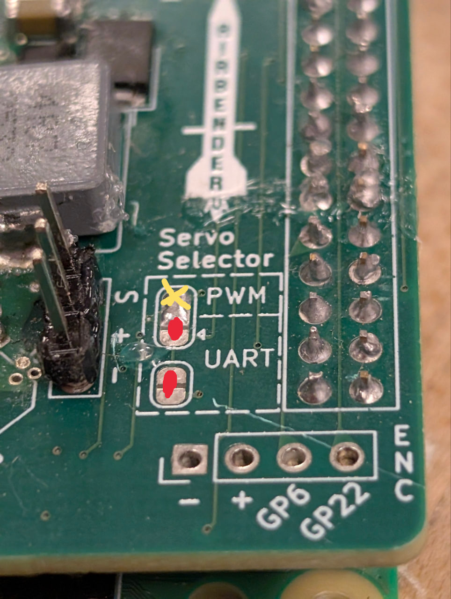
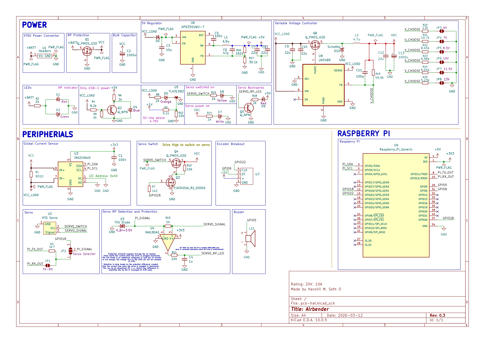

# Electrical Design

The electrical system behind Airbrakes is the backbone to its reliability and simplicity. We will go over every component and detail how they work with the overall system. 

## Design Goals

There are certain design goals we laid out which we've rigrously pursued:

1. **Minimalism**: Having as few components as possible means less things can go wrong.
2. **Modularity**: Can I take this electrical system and slap it on another rocket? The answer must be "Yes".
3. **Idiot proof**: The system should be fault tolerant and be reliable under adverse conditions
4. **Extensibility**: If I have another component I want to use, can I simply swap it out with minimal rework?

## Components

1. **Battery**: Airbrakes requires a lot of power to actuate the gears and it is necessary to have a power supply which can provide that. We use a LiPo for its high and instantaneous current supply capabilities. Anything from a 2S to 4S is accepted.

2. **Servo**: This is what will engage with the gears to actuate the fins out. 
The system is designed to use either the [HTD-85H](https://www.hiwonder.com/products/htd-85h) [UART](https://en.wikipedia.org/wiki/Universal_asynchronous_receiver-transmitter) servo with integrated position feedback, or a regular [PWM](https://en.wikipedia.org/wiki/Pulse-width_modulation) servo which has no position feedback.

3. **PCB**: This is the heart of the electrical system. The bridge between the software and hardware. It integrates with the Raspberry Pi and the [software running on it](software.md).

The PCB, named Airbender, was designed from scratch using KiCAD. You can find the design files [here](https://github.com/NCSU-High-Powered-Rocketry-Club/airbrakes-pi-hat).

<figure markdown="span">
   { width="40%" loading="lazy" }
  <figcaption>
      Airbender, the custom PCB made to go on a Raspberry Pi.
</figcaption>
</figure>

## Airbender Design

This board was designed in such a way to minimize the setup time and complexity. All you need to do is simply plug in the battery, the servo, and put the hat on top of the Pi.

### Features

1. Supports from 7V to 20V input voltage, with a maximum amperage of 10A.
2. Variable output voltage for the servo power rail (6V to 13V), while simultaneously powering the Pi at 5V.
3. Current and voltage sensing for the entire board, which allows measurement of servo load transients.
4. Reverse polarity detection and protection on the input power rail
5. Reverse polarity detection and protection for the servo cable. Plugging in the cable backwards now will not fry the Raspberry Pi.
6. 7 LEDs for monitoring and detecting the health of the board and its interface with the Raspberry Pi.
7. Solder jumper pad to select using a servo via PWM or communicate with the servo via UART
8. P-MOSFET to disable power to the servo rail when not in use
9. Software controlled buzzer for audible alerts

### Usage

#### Selecting the Voltage and Servo Protocol

The first thing you should do is select the voltage by soldering across the pads of the voltage you want. In the picture below, you can see that we've configured 8.5V to be the output for the servo.

<figure markdown="span">
   { width="40%" loading="lazy" }
  <figcaption>
      8.5V is selected by soldering across the two pads.
</figcaption>
</figure>

!!! inline failure "Failure"
    The board will not be able to step up your voltage, so make sure you always select a voltage **LOWER** than the voltage you supply with the LiPo.
    
!!! inline warning "Warning"
    Selecting 2 or more voltages is not supported and may lead to invalid outputs. Make sure only one is soldered by checking continuity with a [multimeter](https://simple.wikipedia.org/wiki/Multimeter).

!!! tip "Tip"
    You should usually only select the voltage your servo can support. Under or over volting the servo can damage it.

Next, you can select the Servo Protocol in a similar fashion as the voltage. The "UART" mode is meant for the [HiWonder Servos](https://www.hiwonder.com/products/htd-85h), which are unique since they use UART for controlling its movements.

<figure markdown="span">
   { width="40%" loading="lazy" }
  <figcaption>
      PWM mode is selected. 
</figcaption>
</figure>

!!! warning "Warning"
    Selecting both modes is not supported and may lead to the pins getting damaged on the Pi!

!!! Tip
    For selecting the UART mode, you solder the jumper pads at the bottom, AND the middle and bottom pad of the 3-jumper pad.

    <figure markdown="span">
    { width="40%" loading="lazy" }
    <figcaption>
        Selecting UART.
    </figcaption>
    </figure>

#### Plugging it in

Using the board is simple and safe. Simply put it on top of the Pi, and use the power input wires situated on the top left of the board to connect it to the battery.

You will see the a few LED's light up on the board. There are 3 "All Good" LEDs:

1. LiPo Power: This says the board is getting power from the battery.
2. Pi 5V: This says the voltage regulator is actually outputting exactly 5V. It would not light up if it's under 4.75V.
3. Servo power: This says that the servo is getting voltage. How much voltage is decided by the [solder jumpers](#selecting-the-voltage-and-servo-protocol).

Next, you should simply connect the servo cable to the jumpers.

#### Enabling the Servo 

The servo is switched on through the Pi using software. Once you SSH into the Pi, run the command:

``` bash { .yaml .copy }
sudo pinctrl set 26 op pu dh
```

This drives GPIO 26 to a high state, which switches on the PMOS on the board and creates a potential difference at the servo output.

!!! warning 
    If you have connected the servo in the wrong orientation (since it's 3 wire), at this step you will see the red "SERVO REVERSE" LED switch on. Immediately disconnect the cable and connect it the other way. 

### Schematic

The electrical schematic is shown below if you'd like to understand every connection made. You may also view the full KiCAD files on our Github:

<figure markdown="span">
   { width="40%" loading="lazy" }
  <figcaption>
      The full KiCAD schematic
      
</figcaption>
[Source files :fontawesome-brands-github:](https://github.com/NCSU-High-Powered-Rocketry-Club/airbrakes-pi-hat){ .md-button .md-button--primary}
</figure>
